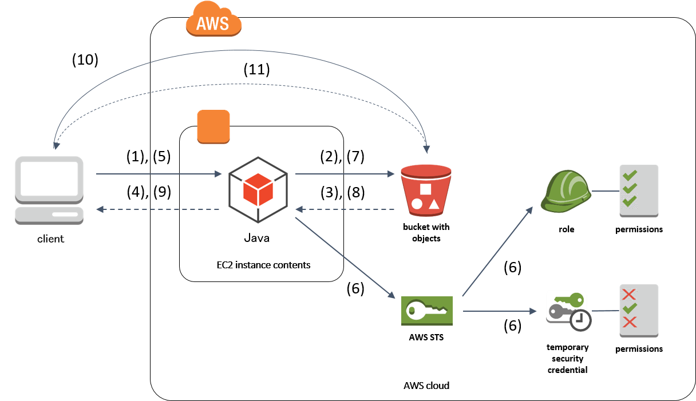

ダウンロードファイル管理
================================================================================

.. only:: html

 .. contents:: 目次
    :depth: 4
    :local:

Overview
--------------------------------------------------------------------------------

本ガイドラインでは、Amazon Simple Storage Service (以降、Amazon S3、あるいは単にS3と表記する) と AWS Security Token Service (以降、AWS STS、あるいは単にSTSと表記) を使用したプライベートダウンロードの実装方法について説明する。

ここでは、署名付きURLが第三者に漏えいした場合に備えて署名付きURLの有効期限をできる限り短くする一方で、正規のクライアントには有効期限切れエラーが発生する可能性をできる限り低くするため、ファイルのダウンロードリクエスト時に動的に署名付きURLを発行する。

.. tabularcolumns:: |p{0.10\linewidth}|p{0.90\linewidth}|
.. list-table::
   :header-rows: 1
   :widths: 10 90

   * - 項番
     - 説明
   * - | (1)
     - | クライアントは、EC2上のアプリケーションにダウンロードファイルの一覧をリクエストする。
     
   * - | (2)
     - | アプリケーションは、S3にダウンロードファイルの一覧をリクエストする。
     
   * - | (3)
     - | S3は、アプリケーションにダウンロードファイルの一覧を返却する。
     
   * - | (4)
     - | アプリケーションは、クライアントにダウンロードファイルの一覧を返却する。
     
   * - | (5)
     - | クライアントは、アプリケーションにダウンロード対象ファイルの署名付きURLをリクエストする。
     
   * - | (6)
     - | アプリケーションは、STSにより当該ファイルが格納されたバケット全体に対するアクセス権限を持つIAMロールから、リクエストされたオブジェクトのみに対するアクセス権限を持つ一時的セキュリティ認証情報を作成する。

   * - | (7)
     - | アプリケーションは、作成した一時的セキュリティ認証情報を使ってS3に署名付きURLをリクエストする。

   * - | (8)
     - | S3は署名付きURLを生成し、アプリケーションに返却する。
     
   * - | (9)
     - | アプリケーションは、クライアントに取得した署名付きURLを返却する。
     
   * - | (10)
     - | クライアントは、取得した署名付きURLを使ってS3にファイルをリクエストする。
     
   * - | (11)
     - | S3は、署名付きURLの有効期限を確認し、期限内である場合はリクエストされたファイルを返却する。

Amazon Simple Storage Service (Amazon S3) とは
^^^^^^^^^^^^^^^^^^^^^^^^^^^^^^^^^^^^^^^^^^^^^^^^^^^^^^^^^^^^^^^^^^^^^^^^^^^^^^^^

Amazon S3は、Amazon Web Servicesが提供するインターネットストレージであり、下記のような特徴がある。

* バケットと呼ばれる保存場所に、固有の識別子となるキーを指定して、様々なオブジェクトを保存できる
* 耐久性、可用性が高い
* インターネット経由でアクセスできるため、ファイルサイズの大きなコンテンツを配信できる

Amazon S3の詳細については、\ `Amazon Simple Storage Service (S3) <https://aws.amazon.com/jp/s3/>`_\ を参照されたい。

S3 のアクセスコントロール
^^^^^^^^^^^^^^^^^^^^^^^^^^^^^^^^^^^^^^^^^^^^^^^^^^^^^^^^^^^^^^^^^^^^^^^^^^^^^^^^

デフォルトでは、S3のバケットとオブジェクトはプライベートアクセス権限のみに設定され、作成したAWSアカウントのみがアクセスできる。

S3へのアクセスは主に以下の要素でコントロールする。

* アクセスコントロールリスト (ACL)
* バケットポリシー
* ユーザーポリシー

以下、各要素について説明する。

アクセスコントロールリスト (ACL)
""""""""""""""""""""""""""""""""""""""""""""""""""""""""""""""""""""""""""""""""

ACLは、バケット/オブジェクトへのアクセスをXMLで定義し、バケット/オブジェクトにアタッチする。AWSアカウントレベルの制御はできるが、IAMユーザレベルの制御はできない。

バケット単位やオブジェクト単位で簡易的に権限を付与する場合などに利用する。

ACLの詳細については、\ `ACL によるアクセス管理 <http://docs.aws.amazon.com/ja_jp/AmazonS3/latest/dev/S3_ACLs_UsingACLs.html>`_\ を参照されたい。

.. NOTE::
   ACL はシステム間連携など、異なるアカウント間でバケットを共有する場合などに用いる。
   以下で説明するプライベートダウンロードでは使用しない。

バケットポリシー
""""""""""""""""""""""""""""""""""""""""""""""""""""""""""""""""""""""""""""""""

バケットポリシーは、バケット/オブジェクトへのアクセスをJSONで定義し、バケットに設定する。AWSアカウントレベル、IAMユーザレベルのいずれでも制御できる。

主にバケット全体のアクセス権限を設定する場合に利用する。

バケットポリシーの詳細については、\ `バケットポリシーの例 <http://docs.aws.amazon.com/ja_jp/AmazonS3/latest/dev/example-bucket-policies.html>`_\ を参照されたい。

ユーザーポリシー
""""""""""""""""""""""""""""""""""""""""""""""""""""""""""""""""""""""""""""""""

ユーザーポリシーは、(S3を含む) AWSリソースへのアクセスをJSONで定義し、IAMリソースにアタッチする。IAMユーザレベルの制御であり、AWSアカウントレベルの制御はできない。

複数バケットやS3以外のものも含めて一元的にユーザ権限を指定する場合などに利用する。

ユーザーポリシーの詳細については、\ `ユーザーポリシーの例 <http://docs.aws.amazon.com/ja_jp/AmazonS3/latest/dev/example-policies-s3.html>`_\ を参照されたい。

Pre-signed URL (署名付きURL) とは
^^^^^^^^^^^^^^^^^^^^^^^^^^^^^^^^^^^^^^^^^^^^^^^^^^^^^^^^^^^^^^^^^^^^^^^^^^^^^^^^

署名付きURLは、Amazon SDK for Javaで動的に作成する署名されたURLであり、一定時間だけS3にアクセスできる。AWSコンソールから作成することはできない。

署名付きURLの詳細については、\ `署名付き URL を使用したオブジェクトのアップロード <http://docs.aws.amazon.com/ja_jp/AmazonS3/latest/dev/PresignedUrlUploadObject.html>`_\ を参照されたい。

.. WARNING::
   署名付きURLには、URLを作成したAWSアカウントまたはIAMユーザのアクセスキーが含まれる。
   
   ルートアカウントなど、アクセスキーが漏えいしてはならないアカウントで作成しないこと。

AWS Security Token Service (AWS STS) とは
^^^^^^^^^^^^^^^^^^^^^^^^^^^^^^^^^^^^^^^^^^^^^^^^^^^^^^^^^^^^^^^^^^^^^^^^^^^^^^^^

AWS STSは、AWSリソースへのアクセスを制御できる一時的なセキュリティ認証情報をもつ、信頼されたユーザーを作成することができる。

一時的セキュリティ認証情報の使用期限は短く、認証情報が失効するとあらゆるタイプのアクセスが許可されなくなる。

AWS STSと署名付きURLを組み合わせることで、短期間のみ有効なURLをセキュアに作成できる。

AWS STSの詳細については \ `一時的セキュリティ認証情報 <http://docs.aws.amazon.com/ja_jp/IAM/latest/UserGuide/id_credentials_temp.html>`_\ を参照されたい。

How to use
--------------------------------------------------------------------------------

上記のアクセス制御機能のうち、以下を組み合わせてプライベートダウンロードを実現する方式を説明する。

* バケットポリシー
* IAMロール
* STS
* 署名付きURL   

バケットポリシーの設定
^^^^^^^^^^^^^^^^^^^^^^^^^^^^^^^^^^^^^^^^^^^^^^^^^^^^^^^^^^^^^^^^^^^^^^^^^^^^^^^^

まず、S3バケットおよびオブジェクトに不必要なポリシーが設定されていないことを確認する。ここでは、バケットポリシーは設定されておらず、デフォルトのプライベートアクセス権限であることとする。

IAMロールの設定
^^^^^^^^^^^^^^^^^^^^^^^^^^^^^^^^^^^^^^^^^^^^^^^^^^^^^^^^^^^^^^^^^^^^^^^^^^^^^^^^

続いて、ダウンロード対象のオブジェクトが格納されたS3バケット全体に対するGetObjectアクションを許可するポリシーを作成する。

.. code-block:: javascript

  {
      "Version": "2012-10-17",
      "Statement": [
          {
              "Sid": "1", // (1)
              "Effect": "Allow", // (2)
              "Action": [
                  "s3:GetObject" // (3)
              ],
              "Resource": [
                  "arn:aws:s3:::private-distribution/*" // (4)
              ]
          }
      ]
  }

各記述内容の詳細は下記の通り。

.. tabularcolumns:: |p{0.10\linewidth}|p{0.90\linewidth}|
.. list-table::
   :header-rows: 1
   :widths: 10 90

   * - 項番
     - 説明
   * - | (1)
     - | ステートメント識別子。ポリシー内で一意な値を指定する
     
   * - | (2)
     - | このステートメントを許可または明示的に拒否する。ここではアクセスを許可したいため `Allow` を指定する
     
   * - | (3)
     - | このステートメントで許可または明示的に拒否されるアクション。ここでは S3 からオブジェクトを取得したいため `s3:GetObject` を指定する
     
   * - | (4)
     - | このステートメントで取り扱うリソース。ここでは `private-distribution` というバケット内のすべてのオブジェクトを指定する

このポリシーをSTSに権限を移譲するロールにアタッチする。

.. WARNING::
   S3 のバケット名は署名付きURLのサブドメインとして利用されることがある。
   RFC2459 では、SSLサーバ証明書のサブドメイン名に指定されているワイルドカード部（`*`）は2階層以上のサブドメインを「適正なドメイン名」として認めていないため、ピリオド (`.`) を含むS3バケット名を使用するとダウンロードクライアントから「不正なドメイン名」と誤認されることで、予期せぬ障害の原因となりうる。
   このため、S3 のバケット名にはピリオドを含めるべきではない。
   
   上述のバケット名 `private-disribution` は、語の区切りにピリオドを使用せずハイフンで代用している例となる。
   S3 バケット名の命名規則と制約の詳細については \ `バケットの制約と制限 <http://docs.aws.amazon.com/ja_jp/AmazonS3/latest/dev/BucketRestrictions.html>`_\ を参照されたい。

サーバサイドの実装
^^^^^^^^^^^^^^^^^^^^^^^^^^^^^^^^^^^^^^^^^^^^^^^^^^^^^^^^^^^^^^^^^^^^^^^^^^^^^^^^

以下、上記のバケットポリシー、およびIAMロールが設定された状態において、プライベートダウンロードを実現する具体的な処理内容を説明する。

なお、ダウンロードファイル一覧表示処理については説明を割愛する。

署名付きURLのクライアント連携
""""""""""""""""""""""""""""""""""""""""""""""""""""""""""""""""""""""""""""""""

まず、クライアントに署名付きURLを返却するコントローラを作成する。

- DownloadController.java

 .. code-block:: java
 
  package com.example.xxx.app.file;

  import java.net.URL;
  import java.time.ZonedDateTime;
  import java.util.Date;

  import javax.inject.Inject;

  import org.springframework.beans.factory.annotation.Value;
  import org.springframework.stereotype.Controller;
  import org.springframework.ui.Model;
  import org.springframework.web.bind.annotation.GetMapping;
  import org.springframework.web.bind.annotation.RequestMapping;
  import org.springframework.web.bind.annotation.RequestParam;
  import org.springframework.web.bind.annotation.ResponseBody;

  import com.example.xxx.domain.helper.S3Helper;

  @Controller // (4)
  @RequestMapping("download") // (1)
  public class DownloadController {
  	// omitted
  	@Value("${cloud.aws.download.expiration:30}") // (2)
  	private int seconds;

  	@Inject
  	S3Helper s3Helper;

  	@GetMapping("url") // (1)
  	@ResponseBody // (4)
  	public DirectUrlResponse getDownloadUrl(@RequestParam("key") String key) { // (1)

  		Date expiration = Date.from(ZonedDateTime.now().plusSeconds(seconds).toInstant()); // (2)

  		URL presignedUrl = s3Helper.generatePresignedUrl(bucketName, key, expiration); // (3)

  		return new DirectUrlResponse(presignedUrl.toString()); // (4)
  	}

  	private class DirectUrlResponse { // (4)
  		private String presignedUrl;
  		// omitted
  	}
  }

各記述内容の詳細は下記の通り。

 .. tabularcolumns:: |p{0.10\linewidth}|p{0.90\linewidth}|
 .. list-table::
     :header-rows: 1
     :widths: 10 90

     * - 項番
       - 説明
     * - | (1)
       - | `@RequestMapping`, `@GetMapping`, `@RequestParam` によってエンドポイントを定義する。
       
         ここでは `download/url?key=<ダウンロード対象オブジェクトのキー文字列>` というGETリクエストにて署名付きURLを取得できるよう定義している。
         
         .. CAUTION::
            認証されたユーザがアクセスできるオブジェクトを適切に制限する要件が考えられる。
            ここでは上記の通り、バケットポリシーおよびIAMロールにて、S3の特定プレフィックス配下にあるオブジェクトにのみアクセスできるようコントロールしている。
            
            業務仕様等でバケットポリシーあるいはIAMロールを詳細に制限できない場合は、オブジェクトキー文字列をねつ造したリクエストにより意図しないオブジェクトにアクセスされる可能性を考慮し、リクエストされたキー文字列の妥当性を適切に検証すること。
       
     * - | (2)
       - | 署名付きURLの有効期限(秒)を設定する。
       
         ここではデフォルト30秒として外部ファイルから有効期限を設定している。
        
     * - | (3)
       - | ダウンロード対象のバケット名、キー文字列、有効期限を指定して署名付きURLを生成する。具体的な処理は後述。
        
     * - | (4)
       - | 生成した署名付きURLをJSON形式で返却する。
       
         .. NOTE::
            今回のサンプルでは、画面を表示するアクションとJSONを返すアクションをひとつのコントローラに共存させているため、クラスとメソッドをそれぞれ `@Controller` と `@ResponseBody` で注釈している。
            
            JSONを返すアクションのみから構成されるコントローラの場合は、これらのメタアノテーションである `@RestController` でクラスを注釈すべきである。
            

署名付きURLの生成
""""""""""""""""""""""""""""""""""""""""""""""""""""""""""""""""""""""""""""""""

続いて、署名付きURLを生成する。

.. NOTE::
   S3に関する処理は煩雑になり易いため、ヘルパークラスを作成して実装を集約することが望ましい。
   以下の説明では、S3に関する処理をS3Helperに集約している。

- S3Helper.java

 .. code-block:: java

  package com.example.xxx.domain.helper;
  // omitted
  import java.net.URL;
  import java.util.Date;
  import org.springframework.beans.factory.InitializingBean;
  import com.amazonaws.services.s3.AmazonS3;
  // omitted
  
  @Component
  public class S3Helper implements InitializingBean {
  	// omitted
  	public URL generatePresignedUrl(String bucketName, String key, Date expiration) {
  		String policy = getPolicy(bucketName, key); // (1)
  		AmazonS3 amazonS3 = getClient(policy); // (2)
  		return amazonS3.generatePresignedUrl(bucketName, key, expiration); // (3)
  	}
  	// omitted
  }
 
各記述内容の詳細は下記の通り。
 
 .. tabularcolumns:: |p{0.10\linewidth}|p{0.90\linewidth}|
 .. list-table::
     :header-rows: 1
     :widths: 10 90

     * - 項番
       - 説明
     * - | (1)
       - | 一時的に有効なSTSクライアントに設定するポリシーを作成する。詳細は後述。
       
     * - | (2)
       - | 作成したポリシーを指定してAmazon S3クライアントを作成する。詳細は後述。
       
     * - | (3)
       - | ダウンロード対象のバケット名、キー文字列、有効期限を指定して署名付きURLを取得し、返却する。

ポリシー設定
""""""""""""""""""""""""""""""""""""""""""""""""""""""""""""""""""""""""""""""""

続いて、一時的に有効なSTSクライアントに設定するポリシーを作成する。

- S3Helper.java

 .. code-block:: java
 
  package com.example.xxx.domain.helper;
  // omitted
  import org.springframework.stereotype.Component;

  import com.amazonaws.auth.policy.Policy;
  import com.amazonaws.auth.policy.Resource;
  import com.amazonaws.auth.policy.Statement;
  import com.amazonaws.auth.policy.actions.S3Actions;

  @Component
  public class S3Helper implements InitializingBean {

  	public static final String DELIMITER = "/";
  	// omitted
  	private String getPolicy(String bucketName, String key) {

  		String resource = "arn:aws:s3:::" + bucketName + DELIMITER + key;

  		Statement statement = new Statement(Statement.Effect.Allow) // (1)
  				.withActions(S3Actions.GetObject) // (2)
  				.withResources(new Resource(resource)); // (3)

  		Policy policy = new Policy().withStatements(statement); // (4)
  		return policy.toJson(); // (5)
  	}
  	// omitted
  }

各記述内容の詳細は下記の通り。

 .. tabularcolumns:: |p{0.10\linewidth}|p{0.90\linewidth}|
 .. list-table::
     :header-rows: 1
     :widths: 10 90

     * - 項番
       - 説明
     * - | (1)
       - | `com.amazonaws.auth.policy.Statement` オブジェクトを使ってステートメントを作成する。ここでは、このステートメントを許可したいため `Allow` を指定する
     * - | (2)
       - | このステートメントで実行するアクションを指定する。ここでは S3 からオブジェクトを取得したいため `S3Actions.GetObject` を指定する
     * - | (3)
       - | このステートメントで取り扱うリソースを指定する。引数に指定されたバケット名およびキー文字列から組み立てたリソース名を指定する
     * - | (4)
       - | 作成した `Statement` を指定して `com.amazonaws.auth.policy.Policy` オブジェクトを作成する
     * - | (5)
       - | 作成した `Policy` の JSON 表現文字列を返す

STSからの認証情報取得
""""""""""""""""""""""""""""""""""""""""""""""""""""""""""""""""""""""""""""""""

続いて、作成したポリシーを指定してAmazon S3クライアントを作成する。

- S3Helper.java

 .. code-block:: java

  package com.example.xxx.domain.helper;
  // omitted
  import java.util.concurrent.TimeUnit;

  import javax.inject.Inject;

  import org.springframework.beans.factory.annotation.Value;

  import com.amazonaws.auth.STSAssumeRoleSessionCredentialsProvider;
  import com.amazonaws.services.identitymanagement.AmazonIdentityManagementClientBuilder;
  import com.amazonaws.services.identitymanagement.model.GetRoleRequest;
  import com.amazonaws.services.s3.AmazonS3;
  import com.amazonaws.services.s3.AmazonS3ClientBuilder;
  // omitted  
  @Component
  public class S3Helper implements InitializingBean { // (1)

  	public static final int STS_MIN_DURATION_MINUTES = 15;
    
  	@Value("${download.roleName}")
  	String roleName;
  	
  	@Value("${download.roleSessionName}")
  	String roleSessionName;
  	
  	private String roleArn;

  	@Override
  	public void afterPropertiesSet() throws Exception { // (1)
  		GetRoleRequest request = new GetRoleRequest().withRoleName(roleName);
  		roleArn = AmazonIdentityManagementClientBuilder.defaultClient().getRole(request).getRole().getArn();
  	}

  	// omitted
  	private AmazonS3 getClient(String policy) {
  	
  		int minDurationSeconds = (int) TimeUnit.MINUTES.toSeconds(STS_MIN_DURATION_MINUTES);
  
  		STSAssumeRoleSessionCredentialsProvider credentialsProvider =
  			new STSAssumeRoleSessionCredentialsProvider.Builder(roleArn, roleSessionName) // (2)
  			.withRoleSessionDurationSeconds(minDurationSeconds) // (2)
  			.withScopeDownPolicy(policy) // (2)
  			.build();
  
  		return AmazonS3ClientBuilder.standard().withCredentials(credentialsProvider).build(); // (3)
  	}
  }

各記述内容の詳細は下記の通り。

 .. tabularcolumns:: |p{0.10\linewidth}|p{0.90\linewidth}|
 .. list-table::
     :header-rows: 1
     :widths: 10 90

     * - 項番
       - 説明       
     * - | (1)
       - | 外部ファイルから読み込んだ権限委譲元のロール名から ARN (Amazon Resource Name) を取得する。
       
         API を実行するため、通信コストを考慮する必要がある。ここでは、一度のみ実行される ``com.amazonaws.services.identitymanagement.AmazonIdentityManagementClientBuilder#defaultClient()`` で実施し、取得した値をフィールドに保持する。

     * - | (2)
       - | 一時的な認証情報プロバイダを生成する。指定する変数、および具体的な値は下記の通り。
         
         :roleArn: 
           (1)で取得した権限委譲元ロールのARN
        
         :roleSessionName:
           一時的に有効化するロール名。ここでは、外部ファイルに指定したロールセッション名を読み込んで指定している。
         
         :minDurationSeconds: 
           有効期限。ここでは、STSの最短有効時間 (15分) を固定値として指定している。
        
         :policy:
           上記にて作成したポリシーのJSON文字列。
          
     * - | (3)
       - | 作成した一時的な認証情報プロバイダを使って S3 クライアントを作成する。

クライアントサイドの実装
^^^^^^^^^^^^^^^^^^^^^^^^^^^^^^^^^^^^^^^^^^^^^^^^^^^^^^^^^^^^^^^^^^^^^^^^^^^^^^^^

最後に、上記にて生成、取得した署名付きURLを使ってファイルをダウンロードする具体的な処理内容を説明する。

ダウンロード
""""""""""""""""""""""""""""""""""""""""""""""""""""""""""""""""""""""""""""""""

まず、JSP にてダウンロードファイルのリストに `key` というclass属性が付与されたアンカーを設定する。

- index.jsp

 .. code-block:: jsp

  <!DOCTYPE html>
  <html>
  <head>
  <!-- ommited -->
  
  </head>
  <body>
  <h1>ダウンロード</h1>

  <ul>
  <c:forEach var="key" items="${keys}">
      <li><a href="#" class="key">${key}</a></li>
  </c:forEach>
  </ul>

  
  
  </body>
  </html>

続いて、JavaScript にて `key` というclass属性にクリックイベントを設定する。

 .. code-block:: javascript
 
  $(".key").click(function() { // (1)
      var key = $(this).text(); // (2)
      $.ajax({
          url: '${pageContext.request.contextPath}/download/url?key=' + key, // (2)
          type: 'GET',
          success: function(data, status, xhr) { // (2)
              var url = data.presignedUrl; // (3)
              var a = document.createElement('a'); // (3)
              a.download = key;
              a.href = url;
              a.click(); // (3)
          },
          error: function(xhr, status, error) { // (4)
              // ommited
          }
      });
  });

各記述内容の詳細は下記の通り。

 .. tabularcolumns:: |p{0.10\linewidth}|p{0.90\linewidth}|
 .. list-table::
     :header-rows: 1
     :widths: 10 90

     * - 項番
       - 説明
     * - | (1)
       - | `key` というclass属性を持つ要素のクリックイベントを定義する。
       
     * - | (2)
       - | クリックされた要素のテキストをキー文字列として、署名付きURLをXmlHttpRequestで取得する。
       
     * - | (3)
       - | 処理に成功した場合は、レスポンスデータから署名付きURLを取り出し、ダウンロードする。

     * - | (4)
       - | 処理に失敗した場合は、要件に応じて適宜ハンドリングする。
