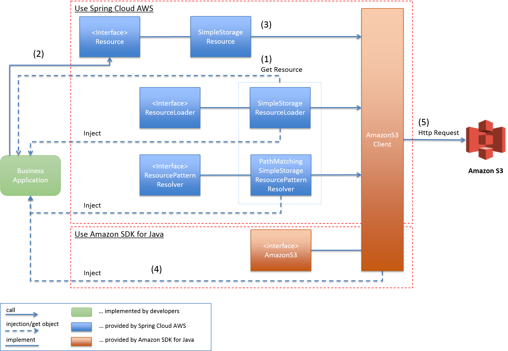

アップロードファイル管理
================================================================================

.. only:: html

 .. contents:: 目次
    :depth: 3
    :local:

Overview
--------------------------------------------------------------------------------

本ガイドラインでは、Amazon Simple Storage Service（以降、S3）を使用した仮アップロードファイルの保存方法について説明する。

.. note::

    本ガイドラインでは、アップロードファイルをS3のストレージに保存する方法および留意点のみを説明する。

    AWS環境におけるファイルアップロードの実装方法は |base_framework_name| Development Guideline `ファイルアップロード <https://macchinetta.github.io/server-guideline/1.6.0.RELEASE/ja/ArchitectureInDetail/WebApplicationDetail/FileUpload.html>`_  に記載の内容と基本的に同様であり、アップロードファイルの保存先をAWSが提供するストレージサービスであるS3に保存する点のみが異なる。

.. note::

    本ガイドラインでは、仮アップロードを目的としたオブジェクト保存方法の説明に主眼を置くため、S3のオブジェクトのバージョニングについては考慮しない。

AWS環境では、Auto Scalingを使用した動的なスケーリングが可能である。
そのため、仮アップロードファイルはローカルストレージに保存せず、APサーバ外のストレージに保存する必要がある。
AWS環境では、ストレージサービスとしてS3が提供されているため、仮アップロードファイルの保存先として活用できる。
アプリケーションからS3へのアクセスは、Spring Cloud AWSまたはAmazon SDK for Javaを使用して行う。

アプリケーションからS3へのアクセス
^^^^^^^^^^^^^^^^^^^^^^^^^^^^^^^^^^^^^^^^^^^^^^^^^^^^^^^^^^^^^^^^^^^^^^^^^^^^^^^^
アプリケーションからS3へアクセスする仕組みは以下の通り。

.. tabularcolumns:: |p{0.10\linewidth}|p{0.90\linewidth}|
.. list-table::
   :header-rows: 1
   :widths: 10 90

   * - 項番
     - 説明
   * - | (1)
     - | S3へアクセスを行うクラスにインジェクションした\ ``SimpleStorageResourceLoader``\ または\ ``PathMatchingSimpleStorageResourcePatternResolver``\ を使用し、\ ``SimpleStorageResource``\ を取得する。
       | 取得を行う際、内部的にはAmazon SDK for Javaの\ ``AmazonS3Client``\ を呼び出している。
   * - | (2)
     - | アプリケーションは\ ``SimpleStorageResource``\ を使用してS3へのアクセスを行う。
   * - | (3)
     - | \ ``SimpleStorageResource``\ は\ ``AmazonS3Client``\ を使用してS3へのアクセスを行う。
   * - | (4)
     - | オブジェクトの削除などの保存/取得以外の操作を行う場合、S3へアクセスを行うクラスに\ ``AmazonS3Client``\ をインジェクションして使用する。
   * - | (5)
     - | \ ``AmazonS3Client``\ はS3に対してHTTPリクエストによるオブジェクト操作を行う。

How to use
--------------------------------------------------------------------------------
ライブラリの使い分け
^^^^^^^^^^^^^^^^^^^^^^^^^^^^^^^^^^^^^^^^^^^^^^^^^^^^^^^^^^^^^^^^^^^^^^^^^^^^^^^^

S3へのアクセスはSpring Cloud AWSまたはAmazon SDK for Javaを使用することで実装可能であるが、両者の使い分けについて説明する。

Spring Cloud AWSによる実装では、Spring Frameworkが提供する\ ``Resource``\ インターフェースによるリソースアクセスの抽象化が利用可能である。
そのため、実装の標準化の観点からSpring Cloud AWSを使用して実装可能な機能については同ライブラリを使用して実装することが望ましい。
\ ``Resource``\ インターフェースの詳細については、Spring Framework Reference Documentation `Resources <https://docs.spring.io/spring/docs/5.0.8.RELEASE/spring-framework-reference/core.html#resources>`_ を参照されたい。

ただし、Spring Cloud AWSでは以下のオブジェクト操作のみ実装可能である。

* S3へのオブジェクト保存
* S3からのオブジェクト取得
* AntパターンによるS3内のオブジェクト検索

オブジェクトの削除やバケット操作などのSpring Cloud AWSでは実装不可能な機能についてはAmazon SDK for Javaを直接使用する必要がある。

.. note::

   ライブラリを併用する場合には実装が煩雑となるため、S3へのアクセスを行う部分はHelperクラスを作成して実装を集約することが望ましい。
   ファイル操作の実装方法については \ :ref:`UploadFileManagement_file_operation_imprements-label`\ を参照されたい。

.. note::

   Spring Cloud AWSではS3へのアクセスを行う際に\ ``s3://``\ をプレフィックスとするバケット名とオブジェクトキーを含む文字列を使用する。

   例）s3://myBucket/myDirectory/myObject.txt

   一方、Amazon SDK for Javaでは、バケット名とオブジェクトキーをそれぞれ指定する必要がある。

   * バケット名 ： myBucket
   * オブジェクトキー ： myDirectory/myObject.txt

   Helperクラスを作成する際は留意すること。

Spring Cloud AWSの利用
^^^^^^^^^^^^^^^^^^^^^^^^^^^^^^^^^^^^^^^^^^^^^^^^^^^^^^^^^^^^^^^^^^^^^^^^^^^^^^^^
依存ライブラリの追加
""""""""""""""""""""""""""""""""""""""""""""""""""""""""""""""""""""""""""""""""

Spring Cloud AWSを利用したS3へのアクセスを行うための依存ライブラリの追加を行う。

- :file:`xxx-domain/pom.xml`

  .. code-block:: xml

        <!-- (1) -->
        <dependency>
            <groupId>org.springframework.cloud</groupId>
            <artifactId>spring-cloud-context</artifactId>
        </dependency>

 .. tabularcolumns:: |p{0.10\linewidth}|p{0.90\linewidth}|
 .. list-table::
    :header-rows: 1
    :widths: 10 90

    * - 項番
      - 説明
    * - | (1)
      - | \ ``spring-cloud-context``\ の依存関係を追加する。

アプリケーションの設定
""""""""""""""""""""""""""""""""""""""""""""""""""""""""""""""""""""""""""""""""

Spring Frameworkの\ ``Resource``\ インターフェースを利用したS3へのアクセスを行うためのBean定義を行う。
Bean定義の詳細については、 Spring Cloud AWS `Resource handling <http://cloud.spring.io/spring-cloud-static/spring-cloud-aws/2.0.0.RELEASE/single/spring-cloud-aws.html#_resource_handling>`_ を参照されたい。

- :file:`xxx-domain/src/main/resources/META-INF/spring/xxx-domain.xml`

  .. code-block:: xml

        <!-- (1) -->
        <beans xmlns="http://www.springframework.org/schema/beans"
            xmlns:xsi="http://www.w3.org/2001/XMLSchema-instance"
            xmlns:aws-context="http://www.springframework.org/schema/cloud/aws/context"
            xsi:schemaLocation="http://www.springframework.org/schema/beans http://www.springframework.org/schema/beans/spring-beans.xsd
                http://www.springframework.org/schema/cloud/aws/context http://www.springframework.org/schema/cloud/aws/context/spring-cloud-aws-context.xsd">

            <!-- (2) -->
            <aws-context:context-resource-loader/>

  .. tabularcolumns:: |p{0.26\linewidth}|p{0.26\linewidth}|p{0.74\linewidth}|
  .. list-table::
    :header-rows: 1
    :widths: 10 26 64

    * - 項番
      - 属性名
      - 内容
    * - | (1)
      - | xmlns:aws-context
      - | AWS Context Namespaceを定義する。
        | 値として\ ``http://www.springframework.org/schema/cloud/aws/context``\ を指定する。
    * - |
      - | xsi:schemaLocation
      - | スキーマのURLを指定する。
        | 値に\ ``http://www.springframework.org/schema/cloud/aws/context``\ と\ ``http://www.springframework.org/schema/cloud/aws/context/spring-cloud-aws-context.xsd``\ を追加する。
    * - | (2)
      - | -
      - | \ ``<aws-context:context-resource-loader/>``\ を利用して\ ``ResourceLoader``\ インターフェースを利用したS3へのアクセスを有効化する。

.. note::

   Spring Cloud AWSを利用するための設定を行うことでAmazon SDK for Javaを利用するための設定も包含されるため、追加の設定は不要である。

マルチパートアップロードの利用設定
""""""""""""""""""""""""""""""""""""""""""""""""""""""""""""""""""""""""""""""""

Spring Cloud AWSでは、S3の機能であるマルチパートアップロード(大容量オブジェクトの分割アップロード)をサポートしている。
S3のマルチパートアップロードについては Amazon Simple Storage Service 開発者ガイド `マルチパートアップロードの概要 <http://docs.aws.amazon.com/ja_jp/AmazonS3/latest/dev/mpuoverview.html>`_ を参照されたい。

前述の設定に加えて以下の設定を行うことでマルチパートアップロードを有効にすることが出来る。

- :file:`xxx-domain/src/main/resources/META-INF/spring/xxx-domain.xml`

  .. code-block:: xml

        <!-- (1) -->
        <beans xmlns="http://www.springframework.org/schema/beans"
            xmlns:xsi="http://www.w3.org/2001/XMLSchema-instance"
            xmlns:aws-context="http://www.springframework.org/schema/cloud/aws/context"
            xmlns:task="http://www.springframework.org/schema/task"
            xsi:schemaLocation="http://www.springframework.org/schema/beans http://www.springframework.org/schema/beans/spring-beans.xsd
                http://www.springframework.org/schema/cloud/aws/context http://www.springframework.org/schema/cloud/aws/context/spring-cloud-aws-context.xsd
                http://www.springframework.org/schema/task http://www.springframework.org/schema/task/spring-task.xsd">

            <!-- (2) -->
            <aws-context:context-resource-loader task-executor="executor" />
            <task:executor id="executor" pool-size="10" queue-capacity="0" rejection-policy="CALLER_RUNS" />

  .. tabularcolumns:: |p{0.26\linewidth}|p{0.26\linewidth}|p{0.74\linewidth}|
  .. list-table::
    :header-rows: 1
    :widths: 10 26 64

    * - 項番
      - 属性名
      - 内容
    * - | (1)
      - | xmlns:task
      - | Task Namespaceを定義する。
        | 値として\ ``http://www.springframework.org/schema/task``\ を指定する。
    * - |
      - | xsi:schemaLocation
      - | スキーマのURLを指定する。
        | 値に\ ``http://www.springframework.org/schema/task``\ と\ ``http://www.springframework.org/schema/task/spring-task.xsd``\ を追加する。
    * - | (2)
      - | -
      - | マルチパートアップロードを行うための\ ``task-executor``\ を定義する。

詳細については Spring Cloud AWS `9.3.1. Uploading multi-part files <http://cloud.spring.io/spring-cloud-static/spring-cloud-aws/2.0.0.RELEASE/single/spring-cloud-aws.html#_uploading_multi_part_files>`_ を参照されたい。

.. warning::

     マルチパートアップロードを有効にしている場合、

     * 5MB未満のファイルの場合：同期アップロード
     * 5MB以上のファイルの場合：5MB毎にマルチパートアップロード

     が行われる。
     設定したpool-sizeを上限に、5MB毎にスレッドが作成される。
     5MBのしきい値は外部から変更することはできない。

     各スレッド毎に最大5MBのメモリ消費が発生するため、サイズの大きなファイルの保存を行う場合は留意すること。
     また、キューイングされたリクエストもメモリを消費するため、\ ``queue-capacity``\ の値にも留意する必要がある。

     マルチパートアップロードの設定を行っていない場合は常に同期アップロードが実行される。

.. _UploadFileManagement_file_operation_imprements-label:

ファイル操作の実装
""""""""""""""""""""""""""""""""""""""""""""""""""""""""""""""""""""""""""""""""

仮アップロードを行う際のファイル操作の実装方法について説明する。

- S3へのオブジェクト保存【Spring Cloud AWSを使用】

  S3バケット上の一時ディレクトリにオブジェクトを保存する。

  .. code-block:: java

    @Inject
    private ResourceLoader resourceLoader; // (1)

    // omitted

    MultipartFile uploadFile = memberRegisterForm.getUploadFile();
    String bucketname = "myBucket";
    String objectKey = "tmpDirectory/uploadFile_" + UUID.randomUUID().toString() + ".jpg";
    WritableResource resource = (WritableResource) this.resourceLoader.getResource("s3://" + bucketname + "/" + objectKey); // (2)(3)
    try (InputStream inputStream = uploadFile.getInputStream(); OutputStream outputStream = resource.getOutputStream()) { // (4)
        IOUtils.copy(inputStream, outputStream);
    } catch (IOException e) {
        // omitted
    }

 .. tabularcolumns:: |p{0.10\linewidth}|p{0.90\linewidth}|
 .. list-table::
    :header-rows: 1
    :widths: 10 90

    * - 項番
      - 説明
    * - | (1)
      - | \ ``ResourceLoader``\ のインジェクションを行う。
        | \ ``<aws-context:context-resource-loader/>``\ が有効である場合、\ ``ResourceLoader``\ として\ ``PathMatchingSimpleStorageResourcePatternResolver``\ が使用される。
    * - | (2)
      - | S3へ保存するファイルパスを指定する。
        | \ ``PathMatchingSimpleStorageResourcePatternResolver``\ は\ ``s3://``\ の接頭辞が付与されたパスをS3へのアクセスと判断する。
    * - | (3)
      - | \ ``WritableResource``\ を取得する。
        | S3へのアクセスを行う場合、\ ``WritableResource``\ として\ ``SimpleStorageResource``\ が取得される。
    * - | (4)
      - | \ ``WritableResource``\ に対して書き込みを行うことでS3へのファイルアップロードを行う。
        | 本ガイドラインでは、\ ``org.apache.commons.io.IOUtils``\ を使用して書き込みを行っている。

.. warning::

     S3のデータ整合性モデルについて

     S3では、高い可用性を実現するために、複数のサーバ間でレプリケーションを行っている。
     そのため、オブジェクトに対する変更が完全に反映されるまでの間に、変更を反映中のオブジェクトに対する参照を行った場合に意図しない結果が返却される可能性がある。
     S3へのアクセスを実装する際は、S3が提供するデータ整合性モデルを踏まえた実装を行う必要がある。
     S3のデータ整合性モデルについては、 Amazon Simple Storage Service ドキュメント 開発者ガイド `Amazon S3 のデータ整合性モデル <https://docs.aws.amazon.com/ja_jp/AmazonS3/latest/dev/Introduction.html#ConsistencyModel>`_ を参照されたい。

     S3では、PUTおよびDELETEの上書きについては結果整合性、オブジェクトの新規作成については書き込み後の読み込み整合性が提供される。
     従って、ファイルの更新を行う場合はオブジェクトキーを変更して別のS3オブジェクトとしてPUTしたものを参照させることで更新前のファイルの参照を防ぐことが可能となる。
     その場合、オブジェクトキーに\ ``UUID``\ を含めるなどでオブジェクトキーが重複しないように留意する必要がある。

- S3からのファイル取得【Spring Cloud AWSを使用】

  S3バケット上の一時ディレクトリに保存したオブジェクトを取得する。
  その後、仮アップロード時と同様に取得したオブジェクトを最終的な保存ディレクトリに保存する。

  .. code-block:: java

    @Inject
    private ResourceLoader resourceLoader; // (1)

    // omitted

    Resource resource = this.resourceLoader.getResource("s3://" + bucketname + "/" + objectKey); // (2)

    // omitted

 .. tabularcolumns:: |p{0.10\linewidth}|p{0.90\linewidth}|
 .. list-table::
    :header-rows: 1
    :widths: 10 90

    * - 項番
      - 説明
    * - | (1)
      - | \ ``ResourceLoader``\ のインジェクションを行う。
    * - | (2)
      - | S3上のパスを指定し、\ ``Resource``\ を取得する。
        | 取得した\ ``Resource``\ に対して必要な処理を行う。

 .. note::

    S3から取得したファイルをユーザにダウンロードさせる方法については、 |base_framework_name| Development Guideline `ファイルダウンロード <https://macchinetta.github.io/server-guideline/1.6.0.RELEASE/ja/ArchitectureInDetail/WebApplicationDetail/FileDownload.html>`_  を参照されたい。

- S3上の単一ファイル削除【Amazon SDK for Javaを使用】

  アップロードファイルの保存後、S3バケット上の一時ディレクトリに保存したオブジェクトを削除する。

  .. code-block:: java

    @Inject
    private AmazonS3 s3client; // (1)

    // omitted

    s3client.deleteObject(bucketname, objectKey); // (2)

 .. tabularcolumns:: |p{0.10\linewidth}|p{0.90\linewidth}|
 .. list-table::
    :header-rows: 1
    :widths: 10 90

    * - 項番
      - 説明
    * - | (1)
      - | \ ``AmazonS3``\ のインジェクションを行う。
        | \ ``ResourceLoader``\ インターフェースを利用するために\ ``<aws-context:context-resource-loader/>``\ を有効にしている場合、\ ``ContextResourceLoaderBeanDefinitionParser``\ によりBean定義された\ ``AmazonS3Client``\ が使用される。
    * - | (2)
      - | バケット名、オブジェクトキーを指定してファイルの削除を行う。

How to extend
--------------------------------------------------------------------------------

仮アップロード以外のファイル操作
^^^^^^^^^^^^^^^^^^^^^^^^^^^^^^^^^^^^^^^^^^^^^^^^^^^^^^^^^^^^^^^^^^^^^^^^^^^^^^^^

代表的なファイル操作の例を以下に示す。

- S3内のAntパターンによるオブジェクト検索【Spring Cloud AWSを使用】

  .. code-block:: java

    private ResourcePatternResolver resourcePatternResolver;

    @Inject// (1)
    public void setupResolver(ApplicationContext applicationContext, AmazonS3 amazonS3){
        this.resourcePatternResolver = new PathMatchingSimpleStorageResourcePatternResolver(amazonS3, applicationContext);
    }

    // omitted

    Resource[] result = resourcePatternResolver.getResources("s3://myBucket/*"); // (2)

    // omitted

 .. tabularcolumns:: |p{0.10\linewidth}|p{0.90\linewidth}|
 .. list-table::
    :header-rows: 1
    :widths: 10 90

    * - 項番
      - 説明
    * - | (1)
      - | \ ``ResourcePatternResolver``\ をSpring Cloud AWSが提供する\ ``PathMatchingSimpleStorageResourcePatternResolver``\ でラップする。
    * - | (2)
      - | S3のパスを指定し、\ ``Resource``\ を配列形式で取得する。
        | 検索に使用する文字列はAntパターンで指定する。

        S3内のAntパターンによるオブジェクト検索については `Searching resources <http://cloud.spring.io/spring-cloud-static/spring-cloud-aws/2.0.0.RELEASE/single/spring-cloud-aws.html#_searching_resources>`_  を参照されたい。

- S3上の複数ファイル削除【Amazon SDK for Javaを使用】

  .. code-block:: java

    @Inject
    private AmazonS3 s3client; // (1)

    // omitted

    //(2)
    List<String> deleteKeyList = new ArrayList<String>();
    // omitted
    List<KeyVersion> targetKeys = new ArrayList<KeyVersion>();
    for (String deleteKey : deleteKeyList) {
        targetKeys.add(new KeyVersion(deleteKey));
    }

    //(3)
    DeleteObjectsRequest deleteObjectsRequest = new DeleteObjectsRequest("myBucket");
    deleteObjectsRequest.setKeys(targetKeys);
    s3client.deleteObjects(deleteObjectsRequest);

 .. tabularcolumns:: |p{0.10\linewidth}|p{0.90\linewidth}|
 .. list-table::
    :header-rows: 1
    :widths: 10 90

    * - 項番
      - 説明
    * - | (1)
      - | \ ``AmazonS3``\ のインジェクションを行う。
    * - | (2)
      - | 削除対象オブジェクトキーのリストを生成する。
    * - | (3)
      - | 削除対象のバケット名を指定して\ ``DeleteObjectsRequest``\ を生成し、削除対象オブジェクトキーのリストを設定してファイルの削除を行う。

.. note::

    \ ``AmazonS3Client``\ を使用する場合、ファイル削除の他にもバケット操作などのS3上の様々な操作が可能である。

    \ ``AmazonS3Client``\ の詳細については\ ``AmazonS3Client``\ の `JavaDoc <http://docs.aws.amazon.com/AWSJavaSDK/latest/javadoc/com/amazonaws/services/s3/AmazonS3Client.html>`_ を参照されたい。

仮アップロード時の不要ファイルのHousekeeping
^^^^^^^^^^^^^^^^^^^^^^^^^^^^^^^^^^^^^^^^^^^^^^^^^^^^^^^^^^^^^^^^^^^^^^^^^^^^^^^^

仮アップロードの仕組みを使用してファイルのアップロードを行う場合に必要なHousekeepingについては、S3の仕組みを利用して行うことができる。

ライフサイクル管理の利用
""""""""""""""""""""""""""""""""""""""""""""""""""""""""""""""""""""""""""""""""

S3では、バケット内のオブジェクトに対してライフサイクルを指定することができる。
ライフサイクル設定を利用して、作成から一定期間を経過したファイルのアーカイブや削除を行えるため、この機能を利用してHousekeepingを行う。

ライフサイクル管理の詳細については、 Amazon Simple Storage Service 開発者ガイド `オブジェクトのライフサイクル管理 <http://docs.aws.amazon.com/ja_jp/AmazonS3/latest/dev/object-lifecycle-mgmt.html>`_ を参照されたい。

.. note::

    ライフサイクル管理において指定可能なターゲット（対象オブジェクト）は、バケット全体もしくはプレフィックス指定による絞込のみである。
    ワイルドカードによる指定などの複雑な制御は行えないため、バケットの構成やオブジェクトの配置に留意すること。

    また、ターゲットに末尾が"/"であるプレフィックスを指定する場合、フォルダ配下のオブジェクトだけではなく、フォルダも削除される。

.. note::

    ライフサイクル管理でHousekeepingの要件を満たせない場合は、オブジェクトの削除機能を実装する必要がある。実装方法については |base_framework_name| Development Guideline `仮アップロード時の不要ファイルのHousekeeping <https://macchinetta.github.io/server-guideline/1.6.0.RELEASE/ja/ArchitectureInDetail/WebApplicationDetail/FileUpload.html#housekeeping>`_  を参照されたい。

Appendix
--------------------------------------------------------------------------------

高いリクエストレートが要求される場合の留意事項
^^^^^^^^^^^^^^^^^^^^^^^^^^^^^^^^^^^^^^^^^^^^^^^^^^^^^^^^^^^^^^^^^^^^^^^^^^^^^^^^

Amazon Simple Storage Service 開発者ガイドにおいて、リクエストレートが高い場合のオブジェクトキーの付与についてのガイドラインが記載されている。

 Amazon Simple Storage Service 開発者ガイド `リクエスト率およびリクエストパフォーマンスに関する留意事項 <http://docs.aws.amazon.com/ja_jp/AmazonS3/latest/dev/request-rate-perf-considerations.html>`_

上記のガイドラインに従うことで、パフォーマンスの低下を防ぐことが可能である。

.. raw:: latex

   \newpage
