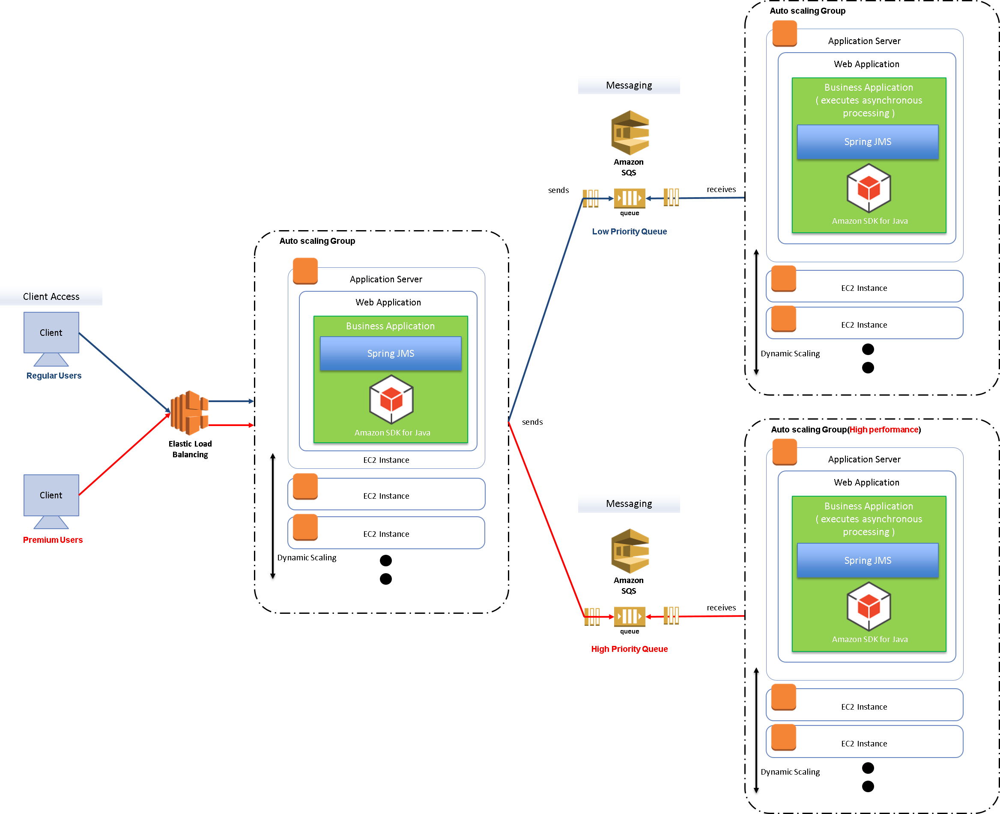

非同期処理の実装（優先順位の設定）
================================================================================

.. only:: html

 .. contents:: 目次
    :depth: 3
    :local:

Overview
--------------------------------------------------------------------------------

| 本ガイドラインでは、Amazon Simple Queue Service（以下、Amazon SQS）を使用した非同期処理（優先順位の設定）の実装方法について説明する。

AWS上での構成
^^^^^^^^^^^^^^^^^^^^^^^^^^^^^^^^^^^^^^^^^^^^^^^^^^^^^^^^^^^^^^^^^^^^^^^^^^^^^^^^
:doc:`../../ImplementationAtEachLayer/Queuing/PriorityQueue` に則って、AWS上では以下の構成とする。

.. note::

   優先順位に応じたキューを2つ用意し、処理能力の違うバックサーバ2つで処理することを前提として説明を進める。

How to use
--------------------------------------------------------------------------------

Amazon SQSの設定
^^^^^^^^^^^^^^^^^^^^^^^^^^^^^^^^^^^^^^^^^^^^^^^^^^^^^^^^^^^^^^^^^^^^^^^^^^^^^^^^

Amazon SQSを使用する為に必要な設定について説明する。

キューの作成
""""""""""""""""""""""""""""""""""""""""""""""""""""""""""""""""""""""""""""""""
| 優先順位の設定を行うために、キューを優先順位の数だけ作成する必要がある。
| 本ガイドラインでは、優先度高と優先度低の2つのキューを作成する。
| キューの作成方法については、共通編の\ :ref:`CreatingQueues`\を参照されたい。

メッセージの送受信に共通する設定
^^^^^^^^^^^^^^^^^^^^^^^^^^^^^^^^^^^^^^^^^^^^^^^^^^^^^^^^^^^^^^^^^^^^^^^^^^^^^^^^

メッセージの送受信に共通する設定については、共通編の\ :ref:`SQSHowToUseEnviromentSetting`\を参照されたい。

メッセージを同期送信する方法
^^^^^^^^^^^^^^^^^^^^^^^^^^^^^^^^^^^^^^^^^^^^^^^^^^^^^^^^^^^^^^^^^^^^^^^^^^^^^^^^

優先順位の設定を行う場合に、クライアントからAmazon SQSキューへメッセージを同期送信する方法を説明する。
共通的な同期送信の方法については、共通編の\ :ref:`SQSHowToUseSyncSendMessage`\を参照されたい。

優先順位変更の同期送信
""""""""""""""""""""""""""""""""""""""""""""""""""""""""""""""""""""""""""""""""

| \ :ref:`SQSHowToUseSettingForSyncSend`\に基づいて優先順位を使用したキューへのメッセージ同期送信の振り分けを行う実装例を紹介する。

- 優先順位を使用したキューへのメッセージ同期送信の振り分け実装

  実装例を以下に示す。

  - PriorityQueueMessageSendServiceImpl.java

   .. code-block:: java

      package com.example.xxx.domain.service.message;

      import java.util.UUID;

      import javax.inject.Inject;

      import org.springframework.beans.factory.annotation.Value;
      import org.springframework.jms.core.JmsMessagingTemplate;
      import org.springframework.stereotype.Service;

      import com.example.xxx.domain.model.FTMessage;

      @Service
      public class PriorityQueueMessageSendServiceImpl implements
                                                       PriorityQueueMessageSendService {

          @Inject
          JmsMessagingTemplate jmsMessagingTemplate;

          @Value("${app.priority.queue.high.name}")
          private String highPriorityQueueName;

          @Value("${app.priority.queue.low.name}")
          private String lowPriorityQueueName;

          @Override
          public String sendMassage(boolean premium) {
              String requestId = UUID.randomUUID().toString();

              // (1)
              if (premium) {
                  jmsMessagingTemplate.convertAndSend(highPriorityQueueName,
                          new FTMessage("send message with high priority queue", requestId));
              } else {
                  jmsMessagingTemplate.convertAndSend(lowPriorityQueueName,
                          new FTMessage("send message with low priority queue", requestId));
              }
              return requestId;
          }

      }

   .. tabularcolumns:: |p{0.10\linewidth}|p{0.90\linewidth}|
   .. list-table::
      :header-rows: 1
      :widths: 10 90

      * - 項番
        - 説明
      * - | (1)
        - | 優先度を判別して、優先順位に応じたキューへ \ ``JmsMessagingTemplate``\ の\ ``convertAndSend``\ メソッドを使用してメッセージを送信する。
          | 実装例では、ユーザがプレミアム会員の場合に優先度高のキュー名を指定してメッセージを送信し、プレミアム会員でない場合に優先度低のキュー名を指定してメッセージを送信する。

メッセージを非同期受信する方法
^^^^^^^^^^^^^^^^^^^^^^^^^^^^^^^^^^^^^^^^^^^^^^^^^^^^^^^^^^^^^^^^^^^^^^^^^^^^^^^^

優先順位の設定を行う場合に、Amazon SQSキューからメッセージを非同期受信する方法を説明する。
共通的な非同期受信方法については、共通編の\ :ref:`SQSHowToUseAsyncReceiveMessage`\を参照されたい。

優先順位変更の非同期受信
""""""""""""""""""""""""""""""""""""""""""""""""""""""""""""""""""""""""""""""""
| \ :ref:`SQSHowToUseSettingForAsyncReceive`\に基づいて優先順位を使用したキューへのメッセージ非同期受信の実装例を紹介する。

- 優先順位を使用したリスナクラスの実装

 実装例を以下に示す。

 - HighPriorityQueueListener.java

  .. code-block:: java

         package com.example.xxx.app.listener;

         import javax.inject.Inject;

         import org.slf4j.Logger;
         import org.slf4j.LoggerFactory;
         import org.springframework.beans.factory.annotation.Value;
         import org.springframework.context.annotation.Profile;
         import org.springframework.jms.annotation.JmsListener;
         import org.springframework.jms.support.JmsHeaders;
         import org.springframework.messaging.handler.annotation.Header;
         import org.springframework.stereotype.Component;
         import com.example.xxx.app.common.handler.JmsErrorHandler;
         import com.example.xxx.domain.common.exception.DuplicateReceivingException;
         import com.example.xxx.domain.common.logging.LogMessages;
         import com.example.xxx.domain.model.FTMessage;
         import com.example.xxx.domain.service.message.MessageService;

         @Component
         @Profile("high-priority-queue") // (1)
         public class HighPriorityQueueListener {

             // omitted

             @Inject
             MessageService messageService;

             @Value("${app.priority.queue.high.name}")
             String queueName;

             @JmsListener(destination = "${app.priority.queue.high.name}", concurrency = "${app.priority.queue.high.concurrency}") // (2)
             public void receive(FTMessage ftMessage,
                     @Header(JmsHeaders.MESSAGE_ID) String messageId) {

                 try {
                     // omitted
                     messageService.processMessage(ftMessage, messageId,
                             queueName);
                 } catch (DuplicateReceivingException e) {
                     return; // (3)
                 }
                 // omitted
             }
         }

  .. tabularcolumns:: |p{0.10\linewidth}|p{0.90\linewidth}|
  .. list-table::
     :header-rows: 1
     :widths: 10 90

     * - 項番
       - 説明
     * - | (1)
       - | 同一アプリケーション内でリスナを実装した場合に、優先順位に応じた処理能力毎にバッチサーバ上で起動を行うため、\ ``@Profile``\を付与して起動を制御する。
         | サーバ起動時に\ ``-Dspring.profiles.active=high-priority-queue``\を指定して使用する対象のリスナのみ稼動させる。
         | 実装例では優先順位の高いキューを指定したサンプルとなっているが、優先順位の低いキューを指定する場合は適宣読み替えて実装する。
     * - | (2)
       - | 非同期受信用のメソッドに対し@JmsListenerアノテーションを設定する。
         | destination属性には、受信先のキュー名を指定する。
         | concurrency属性には、リスナメソッドの並列数の下限・上限を指定する。
         | 実装例では優先順位の高いキューを指定したサンプルとなっているが、優先順位の低いキューを指定する場合は適宣読み替えて実装する。
     * - | (3)
       - | 一意性制約違反によって発生する\ ``DuplicateReceivingException``\ をcatchする。
         | リスナの処理結果として、2重受信の場合に正常応答を返却するため例外をスローしない。

Appendix
--------------------------------------------------------------------------------

遅延キュー設定
^^^^^^^^^^^^^^^^^^^^^^^^^^^^^^^^^^^^^^^^^^^^^^^^^^^^^^^^^^^^^^^^^^^^^^^^^^^^^^^^
| 優先順位低のバッチ処理に遅延キューを使用して処理開始時間を遅延させることで、優先順位高と優先順位低の差をさらに明確にすることができる。
| 遅延キューの作成方法は、`Amazon SQS 遅延キュー <http://docs.aws.amazon.com/ja_jp/AWSSimpleQueueService/latest/SQSDeveloperGuide/sqs-delay-queues.html>`_ を参照されたい。を参照されたい。

.. raw:: latex

   \newpage
