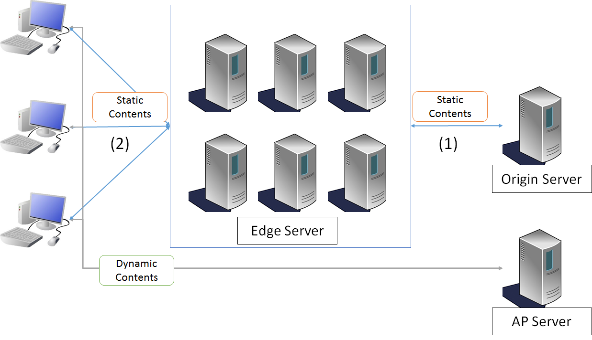

静的コンテンツの配信
================================================================================

.. only:: html

 .. contents:: 目次
    :depth: 3
    :local:

.. _sc_overview:

Overview
--------------------------------------------------------------------------------
本ガイドラインではAWSサービスを使用した静的コンテンツ（画像、 CSS、JavaScript...etc)の配信について説明する。

|

.. _sc_contents_delivery_network:

CDNによる静的コンテンツの配信
^^^^^^^^^^^^^^^^^^^^^^^^^^^^^^^^^^^^^^^^^^^^^^^^^^^^^^^^^^^^^^^^^^^^^^^^^^^^^^^^
CDN(コンテンツデリバリーネットワーク)とは、コンテンツをネットワーク経由で配信するために最適化されたネットワークのことである。
画像や動画、CSSなどの静的コンテンツが配置されているサーバ（オリジンサーバ）から、別の複数のサーバ（エッジサーバ）にキャッシュし、
アクセスするユーザを最寄りのエッジサーバに誘導し配信することで最適なネットワークを実現する。

CDNを用いることで下記が期待できる。

* **世界中にある最適なエッジサーバにユーザを誘導することで高速な配信を行えること**
* **コンテンツをエッジサーバでキャッシュしてオリジンサーバの負荷を減らし、可用性を高めること**

.. _sc_cdn_image:

CDNによる配信イメージ
""""""""""""""""""""""""""""""""""""""""""""""""""""""""""""""""""""""""""""""""
ここでは、CDNを利用しない場合とCDNを利用した場合の配信イメージを紹介する。

* CDNを利用しない配信

.. figure:: ./imagesStaticContents/StaticContentsNonCDN.png
   :width: 50%

.. tabularcolumns:: |p{0.10\linewidth}|p{0.90\linewidth}|
.. list-table::
   :header-rows: 1
   :widths: 10 150

   * - 項番
     - 説明
   * - | (1)
     - | APサーバ内に配置された静的コンテンツを動的コンテンツとともに配信する。

|

* CDNを利用した配信

APサーバから静的コンテンツを排除し、オリジンサーバに配置する。
エッジサーバは静的コンテンツをキャッシュし、クライアントへ静的コンテンツを配信する。

.. tabularcolumns:: |p{0.10\linewidth}|p{0.90\linewidth}|
.. list-table::
   :header-rows: 1
   :widths: 10 150

   * - 項番
     - 説明
   * - | (1)
     - | 複数存在するエッジサーバはオリジンサーバから取得したデータをキャッシュする。
   * - | (2)
     - | エンドユーザに最適なエッジサーバからデータを配信する。

|

.. _sc_contents_delivery_network_aws:

AWSを利用したCDNによる静的コンテンツの配信
^^^^^^^^^^^^^^^^^^^^^^^^^^^^^^^^^^^^^^^^^^^^^^^^^^^^^^^^^^^^^^^^^^^^^^^^^^^^^^^^
AWSではコンテンツ配信ネットワークサービスとして、\ `Amazon CloudFront <https://aws.amazon.com/jp/cloudfront/>`_\ が提供されている。
本ガイドラインでは、オリジン（コンテンツの保存先）として\ `Amazon S3 <https://aws.amazon.com/jp/s3/>`_\ を利用し、S3上の静的コンテンツをCloudFrontを使用してCDNで配信する方法を説明する。

.. _sc_cdn_image_aws:

AWSを用いたCDNによる配信イメージ
""""""""""""""""""""""""""""""""""""""""""""""""""""""""""""""""""""""""""""""""
ここでは、S3とCloudFrontを組み合わせたCDNによる静的コンテンツの配信イメージを紹介する。

* S3とCloudFrontを利用したCDN

S3をオリジンサーバとし、配信する静的コンテンツを配置する。
CloudFrontは複数のエッジサーバへキャッシュを行い、最適なエッジサーバから配信を行う。

.. figure:: ./imagesStaticContents/StaticContentsCDNAWS.png
   :width: 60%

.. tabularcolumns:: |p{0.10\linewidth}|p{0.90\linewidth}|
.. list-table::
    :header-rows: 1
    :widths: 10 150

    * - 項番
      - 説明
    * - | (1)
      - | CloudFrontはS3から多数あるエッジサーバへコンテンツをキャッシュする。
    * - | (2)
      - | CloudFrontはアクセスするユーザを最寄りのエッジサーバへ誘導しコンテンツを配信する。

.. _sc_how_to_use:

How to use
--------------------------------------------------------------------------------

.. _sc_using_s3:

Amazon S3の利用
^^^^^^^^^^^^^^^^^^^^^^^^^^^^^^^^^^^^^^^^^^^^^^^^^^^^^^^^^^^^^^^^^^^^^^^^^^^^^^^^
静的コンテンツの保存先としてS3を利用する際の手順を説明する。

.. _sc_using_s3_bucket:

バケットの作成
""""""""""""""""""""""""""""""""""""""""""""""""""""""""""""""""""""""""""""""""
S3にファイルをアップロードする前にバケットを作成する必要がある。
バケットの作成方法についてはAWS公式ドキュメント\ `バケットの作成 <http://docs.aws.amazon.com/ja_jp/AmazonS3/latest/gsg/CreatingABucket.html>`_\ を参照されたい。

.. note::

  S3では、静的ウェブサイトをホストするときに、バケット名とドメイン名を一致させる必要がある。バケット作成後はバケット名を変更できないため、バケットを作成する際には注意されたい。
  詳細は\ `静的ウェブサイトのホスティング ドメイン名を登録する <https://docs.aws.amazon.com/ja_jp/gettingstarted/latest/swh/getting-started-register-domain.html>`_\ を参照されたい。

.. _sc_using_s3_upload:

コンテンツのアップロード
""""""""""""""""""""""""""""""""""""""""""""""""""""""""""""""""""""""""""""""""
S3のバケット内を下記例の様に既存の資材と同じフォルダ構成にすることで、プロジェクト内の資材からスムーズに移行することができる。

\ :doc:`../ImplementationAtEachLayer/CreateWebApplicationProject`\ で利用した、
\ |base_framework_name|\ の\ `マルチプロジェクト構成のブランクプロジェクト <https://github.com/Macchinetta/macchinetta-web-multi-blank>`_\
のフォルダ構成を例にS3バケットのフォルダ構成例を以下に示す。

* プロジェクト内の既存コンテンツのフォルダ構成例

.. code-block:: text

    ${contextPath}
    └─resources
        ├─css
        ├─image
        └─js

* S3バケットのフォルダ構成例

.. code-block:: text

    ${S3BucketRoot}
    └─resources
        ├─css
        ├─image
        └─js

上記フォルダ構成に従って、S3上に静的コンテンツをアップロードする。

.. note::

    アプリケーションをリリースする際、合わせて静的コンテンツをS3へアップロードする必要があるので注意されたい。

.. _sc_cdn_with_s3_and_cloudfront:

Amazon S3上のコンテンツのAmazon CloudFrontによる配信
^^^^^^^^^^^^^^^^^^^^^^^^^^^^^^^^^^^^^^^^^^^^^^^^^^^^^^^^^^^^^^^^^^^^^^^^^^^^^^^^
S3上のコンテンツをCloudFrontを使用して配信する。
AWS側の設定は\ `Amazon S3 での CloudFront の使用 <http://docs.aws.amazon.com/ja_jp/AmazonCloudFront/latest/DeveloperGuide/MigrateS3ToCloudFront.html>`_\
を参照されたい。
アプリケーション側では、静的コンテンツのパスをCloudFrontのURLに書き換えるだけで良い。
下記では、JSPで使用している静的コンテンツの参照先をプロジェクト内の資材からCloudFrontに変更する設定例を説明する。

* application.yml

.. code-block:: yaml

    # (1)
    content:
      url: https://d111111abcdef8.cloudfront.net

* include.jsp

.. code-block:: jsp

    <!-- (2) -->
    <spring:eval expression="@environment.getProperty('content.url')" var="contentUrl" />

* \ ``contentUrl``\ の利用

.. code-block:: jsp

    <!-- omitted -->
    <!-- (3) -->
    
    <!-- omitted -->

.. tabularcolumns:: |p{0.10linewidth}|p{0.90\linewidth}|
.. list-table::
   :header-rows: 1
   :widths: 10 90

   * - 項番
     - 説明
   * - | (1)
     - | プロパティにCloudFrontのURLを設定する。(例では\ ``${content.url}``\ で参照される)
   * - | (2)
     - | Springの\ ``Environment``\ 経由で\ ``contentUrl``\ としてプロパティを取得する。
          このプロパティは複数画面で使用するので、 \ ``include.jsp``\ などの共通部分で宣言する。
   * - | (3)
     - | 設定した\ ``contentUrl``\ を使用するため、静的コンテンツのpathに\ ``${contentUrl}``\ を設定する。
         画像、CSS、JavaScript等の静的コンテンツのパスすべてに設定する必要がある。

.. note::

  \ ``content.url``\ を環境依存プロパティにすることで、環境ごとに静的コンテンツの参照先を変更することができる。

.. _sc_how_to_extend:

How to extend
--------------------------------------------------------------------------------
.. _sc_access_restriction:

アクセス制限
^^^^^^^^^^^^^^^^^^^^^^^^^^^^^^^^^^^^^^^^^^^^^^^^^^^^^^^^^^^^^^^^^^^^^^^^^^^^^^^^
ここではCloudFrontに対するアクセスを制限する方法を2つ紹介する。

* :ref:`sc_access_restriction_WAF`
    IPアドレスや地域などの条件でアクセスを制限したい場合。

* :ref:`sc_access_restriction_signature`
    有料・プライベートコンテンツなどへのアクセスを制限したい場合。

.. warning::

  CloudFrontへのアクセス制限を設定しても、S3上のコンテンツが公開されている場合、S3に直接接続することでCloudFrontに設けたアクセス制限が適用されずにコンテンツへアクセスすることができてしまう。
  コンテンツの保護を行いたい場合、CloudFrontへの接続制限に加えS3への直接アクセスを制限する必要がある。
  詳細は\ `オリジンアクセスアイデンティティを使用してAmazon S3コンテンツへのアクセスを制限する <http://docs.aws.amazon.com/ja_jp/AmazonCloudFront/latest/DeveloperGuide/private-content-restricting-access-to-s3.html>`_\
  を参照されたい。

.. _sc_access_restriction_WAF:

AWS WAFによる制限
""""""""""""""""""""""""""""""""""""""""""""""""""""""""""""""""""""""""""""""""
Amazonが提供するウェブアプリケーションファイアウォールである\ `AWS WAF <https://aws.amazon.com/jp/waf/>`_\ を使用することで、
定義した条件（IP アドレス、HTTP ヘッダー、HTTP 本文、URI 文字列...etc）に基づき、CloudFrontに対するウェブリクエストを許可、ブロックすることができる。

IP アドレスによる制限が可能なので、開発中等でまだ公開したくない場合や、特定のユーザーにのみ公開したい場合などに有効な制限方法である。

WAFに定義可能な制限項目の詳細はAWS公式ドキュメント\ `What is AWS WAF and AWS Shield Advanced? <http://docs.aws.amazon.com/ja_jp/waf/latest/developerguide/what-is-aws-waf.html>`_\
を、WAFとCloudFrontを組み合わせた際の振る舞いは\ `How AWS WAF Works with Amazon CloudFront Features <http://docs.aws.amazon.com/ja_jp/waf/latest/developerguide/cloudfront-features.html>`_\
を参照されたい。

.. _sc_access_restriction_signature:

署名による制限
""""""""""""""""""""""""""""""""""""""""""""""""""""""""""""""""""""""""""""""""
有料コンテンツなどのプライベートコンテンツへのアクセスコントロールを行いたい場合、
署名付きURLまたはCookieを使用してアクセスするように設定することでアクセスを制限することができる。

CDNを利用して最適なコンテンツ配信を行いつつ、有料コンテンツ購読者などの特定の選ばれたユーザにのみコンテンツを配信したい場合、
署名によるアクセス制限は有効な制限方法である。

詳細は\ `CloudFront を使用してプライベートコンテンツを供給する <http://docs.aws.amazon.com/ja_jp/AmazonCloudFront/latest/DeveloperGuide/PrivateContent.html>`_\
を参照されたい。

.. _sc_fallback_with_route53:

Amazon Route 53を利用したDNSフェイルオーバー
^^^^^^^^^^^^^^^^^^^^^^^^^^^^^^^^^^^^^^^^^^^^^^^^^^^^^^^^^^^^^^^^^^^^^^^^^^^^^^^^
Amazon Route 53を使用することで、CloudFrontへのアクセスが一時的にできなくなった場合に、S3を直接参照させるDNSフェイルオーバーを設定することができる。
Route53のDNSフェイルオーバーについての詳細は
\ `公式ドキュメント <https://docs.aws.amazon.com/ja_jp/Route53/latest/DeveloperGuide/dns-failover-configuring-options.html?console_help=true#dns-failover-failover-rrsets>`_\
を参照されたい。

平常時はCloudFrontを使用してコンテンツを配信し、
障害発生時にはS3からコンテンツを配信するように設定する場合の設定手順を以下に示す。

#. Route 53のヘルスチェックを作成する
#. レコードセットを作成する
    * Failover Record Type:PrimaryにはCloudFrontを指定
    * Failover Record Type:SecondaryにはS3を指定
#. Primaryのレコードセットに作成したヘルスチェックを紐付ける

設定の詳細は\ `Amazon Route 53 ヘルスチェックの作成と DNS フェイルオーバーの設定 <http://docs.aws.amazon.com/ja_jp/Route53/latest/DeveloperGuide/dns-failover.html>`_\
を参照されたい。

.. note::

  本ガイドラインで説明したDNSフェイルオーバーでは、CloudFrontの障害時にS3を直接参照させることでフェイルオーバーを実現している。
  \ :ref:`sc_access_restriction`\ で紹介したようにS3への直接アクセスを制限している場合、このフェイルオーバーを利用することができないので注意されたい。

.. raw:: latex

   \newpage
