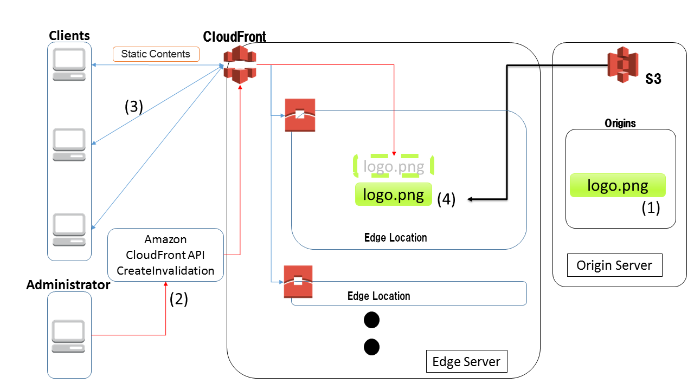
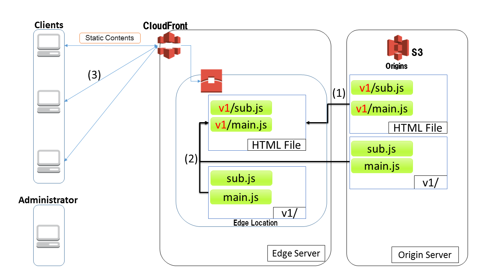

静的コンテンツの配信
================================================================================

.. only:: html

 .. contents:: 目次
    :depth: 3
    :local:

.. _sc_overview:

Overview
--------------------------------------------------------------------------------
本ガイドラインでは、AWSサービスを使用した静的コンテンツ（画像、 CSS、JavaScript...etc)の配信について説明する。

AWSを利用したCDNによる静的コンテンツの配信
^^^^^^^^^^^^^^^^^^^^^^^^^^^^^^^^^^^^^^^^^^^^^^^^^^^^^^^^^^^^^^^^^^^^^^^^^^^^^^^^
AWSではコンテンツ配信ネットワークサービスとして、\ `Amazon CloudFront <https://aws.amazon.com/jp/cloudfront/>`_\ が提供されている。
本ガイドラインでは、オリジン（コンテンツの保存先）として\ `Amazon S3 <https://aws.amazon.com/jp/s3/>`_\ を利用し、S3上の静的コンテンツをCloudFrontを使用してCDNで配信する方法を説明する。

.. _sc_cdn_image_aws:

AWSを用いたCDNによる配信
""""""""""""""""""""""""""""""""""""""""""""""""""""""""""""""""""""""""""""""""
ここでは、S3とCloudFrontを組み合わせたCDNによる静的コンテンツの配信方式を紹介する。

* S3とCloudFrontを利用したCDN

S3をオリジンサーバとし、配信する静的コンテンツを配置する。
CloudFrontは複数のエッジロケーションへキャッシュを行い、最適なエッジロケーションから配信を行う。

.. figure:: ./imagesStaticContents/StaticContentsCDNAWS.png
   :width: 60%

.. tabularcolumns:: |p{0.10\linewidth}|p{0.90\linewidth}|
.. list-table::
    :header-rows: 1
    :widths: 10 150

    * - 項番
      - 説明
    * - | (1)
      - | CloudFrontはS3から多数あるエッジロケーションへコンテンツをキャッシュする。
    * - | (2)
      - | CloudFrontはアクセスするユーザを最寄りのエッジロケーションへ誘導しコンテンツを配信する。

AWSを用いたCDN利用時の静的コンテンツの更新
^^^^^^^^^^^^^^^^^^^^^^^^^^^^^^^^^^^^^^^^^^^^^^^^^^^^^^^^^^^^^^^^^^^^^^^^^^^^^^^^
ここでは、S3とCloudFrontを組み合わせたCDNによる、更新後の静的コンテンツをキャッシュタイムアウトを待たずに配信する方式を紹介する。

方式としては、:ref:`impl_sc_cdn_clear_cache_update_contents` と、:ref:`impl_sc_cdn_update_contents_version` がある。方式の詳細と使い分けについては、:ref:`impl_sc_cdn_update_contents` を参照されたい。

キャッシュクリア方式
""""""""""""""""""""""""""""""""""""""""""""""""""""""""""""""""""""""""""""""""
キャッシュクリア方式とは、CloudFrontのキャッシュをクリアすることで、
キャッシュタイムアウトを待たずに更新後の静的コンテンツをクライアントに配信する方式である。

.. tabularcolumns:: |p{0.10\linewidth}|p{0.90\linewidth}|
.. list-table::
    :header-rows: 1
    :widths: 10 150

    * - 項番
      - 説明
    * - | (1)
      - | S3に保存されている静的コンテンツを更新する。
    * - | (2)
      - | 管理者は、CloudFrontにある(1)で更新した静的コンテンツのキャッシュをCloudFront のCreateInvalidation APIでクリアする。
    * - | (3)
      - | CloudFrontはアクセスするユーザを最寄りのエッジロケーションへ誘導する。
    * - | (4)
      - | CloudFrontに静的コンテンツのキャッシュがないため、S3から更新後の静的コンテンツを取得し、CloudFrontにキャッシュする。更新後の静的コンテンツをCloudFrontから配信する。

コンテンツバージョン管理方式
""""""""""""""""""""""""""""""""""""""""""""""""""""""""""""""""""""""""""""""""
コンテンツバージョン管理方式とは、静的コンテンツをバージョン管理して、整合性を保った状態で更新を行うための方式である。

S3上で更新対象の静的コンテンツをバージョン別フォルダに入れておくなどし、バージョンごとに静的コンテンツへのパスが異なるようにする。更新時には、依存元(更新対象の静的コンテンツを参照している静的コンテンツ)で、更新後の静的コンテンツを利用するようにパスを書き換える。その後、CloudFrontから依存元のキャッシュをクリアする。

依存関係のある静的コンテンツへのパスを整合性のある状態で切り替えることで、更新前と更新後の静的コンテンツが混在した状態でクライアントが取得することを防ぎ、整合性のとれた状態で静的コンテンツを配信する。

以下にHTMLファイルでJavaScriptファイル(main.jsでsub.jsの関数を呼び出している)を読み込んでいる時の例を示す。

* v1リリース時

.. tabularcolumns:: |p{0.10\linewidth}|p{0.90\linewidth}|
.. list-table::
    :header-rows: 1
    :widths: 10 150

    * - 項番
      - 説明
    * - | (1)
      - | HTMLファイルでは、v1フォルダ配下にあるJavaScriptファイルを読み込むように記述する。
    * - | (2)
      - | (1)でのHTMLファイルの記述に従い、v1フォルダ配下のJavaScriptファイルをCloudFrontのキャッシュ、キャッシュがなければ、S3から取得する。
    * - | (3)
      - | CloudFrontはコンテンツをクライアントへ配信する。

* v2リリース時

.. figure:: ./imagesStaticContents/StaticContentsChangePathDeliver_2.png
   :width: 60%

.. tabularcolumns:: |p{0.10\linewidth}|p{0.90\linewidth}|
.. list-table::
    :header-rows: 1
    :widths: 10 150

    * - 項番
      - 説明
    * - | (1)
      - | S3上のHTMLファイルを、v2フォルダ配下にあるJavaScriptファイルを読み込むように更新する。
    * - | (2)
      - | CloudFrontのHTMLファイルのキャッシュをクリアする。
    * - | (3)
      - | クライアントがHTMLファイルを取得しようとすると、CloudFrontにHTMLファイルのキャッシュがないため、S3から更新後のHTMLファイルを取得し、CloudFrontにキャッシュして配信する。
          HTMLファイルがキャッシュクリアされる前に、クライアントがHTMLファイルを読み込んだ場合でも、JavaScriptファイルは、HTMLファイルに記述したパスに従って読み込むため、整合性が保たれる。
    * - | (4)
      - | (1)でのHTMLファイルの記述に従い、v2フォルダ配下のJavaScriptファイルをCloudFrontのキャッシュ、キャッシュがなければ、S3から取得する。
    * - | (5)
      - | CloudFrontはコンテンツをクライアントへ配信する。

.. _sc_how_to_use:

How to use
--------------------------------------------------------------------------------

.. _sc_using_s3:

Amazon S3の利用
^^^^^^^^^^^^^^^^^^^^^^^^^^^^^^^^^^^^^^^^^^^^^^^^^^^^^^^^^^^^^^^^^^^^^^^^^^^^^^^^
静的コンテンツの保存先としてS3を利用する際の手順を説明する。

.. _sc_using_s3_bucket:

バケットの作成
""""""""""""""""""""""""""""""""""""""""""""""""""""""""""""""""""""""""""""""""
S3にファイルをアップロードする前にバケットを作成する必要がある。
バケットの作成方法についてはAWS公式ドキュメント\ `バケットの作成 <http://docs.aws.amazon.com/ja_jp/AmazonS3/latest/gsg/CreatingABucket.html>`_\ を参照されたい。

.. note::

  S3では、静的ウェブサイトをホストするときに、バケット名とドメイン名を一致させる必要がある。バケット作成後はバケット名を変更できないため、バケットを作成する際には注意されたい。
  詳細は\ `静的ウェブサイトのホスティング ドメイン名を登録する <https://docs.aws.amazon.com/ja_jp/gettingstarted/latest/swh/getting-started-register-domain.html>`_\ を参照されたい。

.. _sc_using_s3_upload:

コンテンツのアップロード
""""""""""""""""""""""""""""""""""""""""""""""""""""""""""""""""""""""""""""""""
S3のバケット内を下記例の様に既存の資材と同じフォルダ構成にすることで、プロジェクト内の資材からスムーズに移行することができる。

\ :doc:`../ImplementationAtEachLayer/CreateWebApplicationProject`\ で利用した、
\ |base_framework_name|\ の\ `マルチプロジェクト構成のブランクプロジェクト <https://github.com/Macchinetta/macchinetta-web-multi-blank>`_\
のフォルダ構成を例にS3バケットのフォルダ構成例を以下に示す。

* プロジェクト内の既存コンテンツのフォルダ構成例

.. code-block:: text

    ${contextPath}
    └─resources
        ├─css
        ├─image
        └─js

* S3バケットのフォルダ構成例

.. code-block:: text

    ${S3BucketRoot}
    └─resources
        ├─css
        ├─image
        └─js

上記フォルダ構成に従って、S3上に静的コンテンツをアップロードする。

.. note::

    アプリケーションをリリースする際、合わせて静的コンテンツをS3へアップロードする必要があるので注意されたい。

.. _sc_cdn_with_s3_and_cloudfront:

Amazon S3上のコンテンツのAmazon CloudFrontによる配信
^^^^^^^^^^^^^^^^^^^^^^^^^^^^^^^^^^^^^^^^^^^^^^^^^^^^^^^^^^^^^^^^^^^^^^^^^^^^^^^^
S3上のコンテンツをCloudFrontを使用して配信する。
AWS側の設定は\ `Amazon S3 での CloudFront の使用 <http://docs.aws.amazon.com/ja_jp/AmazonCloudFront/latest/DeveloperGuide/MigrateS3ToCloudFront.html>`_\
を参照されたい。
アプリケーション側では、静的コンテンツのパスをCloudFrontのURLに書き換えるだけで良い。
下記では、JSPで使用している静的コンテンツの参照先をプロジェクト内の資材からCloudFrontに変更する設定例を説明する。

* application.yml

.. code-block:: yaml

    # (1)
    content:
      url: https://xxxxxx.cloudfront.net

* include.jsp

.. code-block:: jsp

    <!-- (2) -->
    <spring:eval expression="@environment.getProperty('content.url')" var="contentUrl" />

* \ ``contentUrl``\ の利用

.. code-block:: jsp

    <!-- omitted -->
    <!-- (3) -->
    
    <!-- omitted -->

.. tabularcolumns:: |p{0.10linewidth}|p{0.90\linewidth}|
.. list-table::
   :header-rows: 1
   :widths: 10 90

   * - 項番
     - 説明
   * - | (1)
     - | プロパティにCloudFrontのURLを設定する。(例では\ ``${content.url}``\ で参照される)
   * - | (2)
     - | Springの\ ``Environment``\ 経由で\ ``contentUrl``\ としてプロパティを取得する。
          このプロパティは複数画面で使用するので、 \ ``include.jsp``\ などの共通部分で宣言する。
   * - | (3)
     - | 設定した\ ``contentUrl``\ を使用するため、静的コンテンツのpathに\ ``${contentUrl}``\ を設定する。
         画像、CSS、JavaScript等の静的コンテンツのパスすべてに設定する必要がある。

.. note::

  \ ``content.url``\ を環境依存プロパティにすることで、環境ごとに静的コンテンツの参照先を変更することができる。

.. _sc_access_cache_clear:

Amazon CloudFront利用時のAmazon S3上のコンテンツの更新
^^^^^^^^^^^^^^^^^^^^^^^^^^^^^^^^^^^^^^^^^^^^^^^^^^^^^^^^^^^^^^^^^^^^^^^^^^^^^^^^

コンテンツバージョン管理方式
""""""""""""""""""""""""""""""""""""""""""""""""""""""""""""""""""""""""""""""""
コンテンツバージョン管理方式はクラウドベンダに依存しない方式であるため、実装方法は :ref:`impl_sc_cdn_update_how_to_use_contents_version` を参照されたい。

Amazon CloudFrontのキャッシュクリア方式
""""""""""""""""""""""""""""""""""""""""""""""""""""""""""""""""""""""""""""""""
CloudFrontのキャッシュクリア方法の詳細は \ `オブジェクトの無効化（ウェブディストリビューションのみ） <http://docs.aws.amazon.com/ja_jp/AmazonCloudFront/latest/DeveloperGuide/Invalidation.html>`_\ を参照されたい。

.. _sc_how_to_extend:

How to extend
--------------------------------------------------------------------------------
.. _sc_access_restriction:

アクセス制限
^^^^^^^^^^^^^^^^^^^^^^^^^^^^^^^^^^^^^^^^^^^^^^^^^^^^^^^^^^^^^^^^^^^^^^^^^^^^^^^^
ここではCloudFrontに対するアクセスを制限する方法を2つ紹介する。

* :ref:`sc_access_restriction_WAF`
    IPアドレスや地域などの条件でアクセスを制限したい場合。

* :ref:`sc_access_restriction_signature`
    有料・プライベートコンテンツなどへのアクセスを制限したい場合。

.. warning::

  CloudFrontへのアクセス制限を設定しても、S3上のコンテンツが公開されている場合、S3に直接接続することでCloudFrontに設けたアクセス制限が適用されずにコンテンツへアクセスすることができてしまう。
  コンテンツの保護を行いたい場合、CloudFrontへの接続制限に加えS3への直接アクセスを制限する必要がある。
  詳細は\ `オリジンアクセスアイデンティティを使用してAmazon S3コンテンツへのアクセスを制限する <http://docs.aws.amazon.com/ja_jp/AmazonCloudFront/latest/DeveloperGuide/private-content-restricting-access-to-s3.html>`_\
  を参照されたい。

.. _sc_access_restriction_WAF:

AWS WAFによる制限
""""""""""""""""""""""""""""""""""""""""""""""""""""""""""""""""""""""""""""""""
Amazonが提供するウェブアプリケーションファイアウォールである\ `AWS WAF <https://aws.amazon.com/jp/waf/>`_\ を使用することで、
定義した条件（IP アドレス、HTTP ヘッダー、HTTP 本文、URI 文字列...etc）に基づき、CloudFrontに対するウェブリクエストを許可、ブロックすることができる。

IP アドレスによる制限が可能なので、開発中等でまだ公開したくない場合や、特定のユーザにのみ公開したい場合などに有効な制限方法である。

WAFに定義可能な制限項目の詳細はAWS公式ドキュメント\ `What is AWS WAF and AWS Shield Advanced? <http://docs.aws.amazon.com/ja_jp/waf/latest/developerguide/what-is-aws-waf.html>`_\
を、WAFとCloudFrontを組み合わせた際の振る舞いは\ `How AWS WAF Works with Amazon CloudFront Features <http://docs.aws.amazon.com/ja_jp/waf/latest/developerguide/cloudfront-features.html>`_\
を参照されたい。

.. _sc_access_restriction_signature:

署名による制限
""""""""""""""""""""""""""""""""""""""""""""""""""""""""""""""""""""""""""""""""
CloudFrontはコンテンツへのアクセスコントロールを行いたい場合、署名付きURLまたはCookieを使用して制限することができる。
CDNを使用してプライベートコンテンツを供給する場合に有効な制限方法である。

詳細は\ `CloudFront を使用してプライベートコンテンツを供給する <http://docs.aws.amazon.com/ja_jp/AmazonCloudFront/latest/DeveloperGuide/PrivateContent.html>`_\
を参照されたい。

署名付きURLと署名付きCookieのどちらを使用するかの選択については\ `署名付き URL と署名付き Cookie の選択 <http://docs.aws.amazon.com/ja_jp/AmazonCloudFront/latest/DeveloperGuide/private-content-choosing-signed-urls-cookies.html>`_\
を参照されたい。

.. note::

  署名付き URL や署名付き Cookie を作成するために、有効なCloudFront キーペアが必要となる。
  IAM ユーザでは CloudFront キーペアを作成することができず、AWS アカウントのルート認証情報を使用してキーペアを作成する必要があるので注意されたい。
  詳細は\ `信頼された署名者の CloudFront キーペアを作成する <http://docs.aws.amazon.com/ja_jp/AmazonCloudFront/latest/DeveloperGuide/private-content-trusted-signers.html#private-content-creating-cloudfront-key-pairs>`_\ を参照されたい。

.. _sc_signed-cookies:

署名付きCookie
''''''''''''''''''''''''''''''''''''''''''''''''''''''''''''''''''''''''''''''''''''''''''''''''''''''''''''''''''''''''''''''''''''''''''''''''''''''''''''''''
署名付きCookieを作成してプライベートコンテンツを配信する実装方法を紹介する。
本ガイドラインでは、有料会員向けに複数の制限されたファイルへのアクセスを提供するアプリケーションを実装例として説明する。

実装例では、プライベートコンテンツの配信が必要なアクセスに対して署名付きCookieを発行する仕組みを透過的に実現する実装として、Controllerに付与されたアノテーションをインターセプトして署名付きCookie発行する実装を紹介する。
また、その際に署名付きCookieが不要となった場合の削除方法もあわせて紹介する。

.. warning::

  署名付きCookieを使用してプライベートコンテンツを配信する際には、署名付きCookieの悪用の防止について配慮する必要がある。
  詳細は公式ドキュメント\ `署名付き Cookie の悪用の防止 <http://docs.aws.amazon.com/ja_jp/AmazonCloudFront/latest/DeveloperGuide/private-content-signed-cookies.html#private-content-signed-cookie-misuse>`_\ を参照されたい。

* 有料会員の権限保持者のみに署名付きCookieを発行するために、コントローラに付与するアノテーションの作成

 .. code-block:: java

   @Target(METHOD)
   @Retention(RetentionPolicy.RUNTIME)
   @Documented
   public @interface PresignedCookie {

       // (1)
       String[] value();

   }

 .. tabularcolumns:: |p{0.10linewidth}|p{0.90\linewidth}|
 .. list-table::
     :header-rows: 1
     :widths: 10 90

     * - 項番
       - 説明
     * - | (1)
       - | 署名付きCookieの発行対象のロールを指定する為の属性。

|

* 有料会員の権限保持者のみに署名付きCookieを発行するためのインターセプタの作成

 .. code-block:: java

   public class PresignedCookieHandlerInterceptor implements HandlerInterceptor {

       // (1)
       @Inject
       CloudFrontSignatureHelper signatureHelper;

       @Override
       public boolean preHandle(HttpServletRequest request,
               HttpServletResponse response, Object handler) throws Exception {
           // omitted
           return true;
       }

       @Override
       public void postHandle(HttpServletRequest request,
               HttpServletResponse response, Object handler,
               ModelAndView modelAndView) throws Exception {

           if (!enablePresignedCookie(handler)) { // (2)
               return;
           }

           CookiesForCustomPolicy cookies = signatureHelper.getSignedCookies(); // (3)

           // (4)
           Cookie cookiePolicy = new Cookie(cookies.getPolicy().getKey(), cookies
                   .getPolicy().getValue());
           cookiePolicy.setHttpOnly(true);
           cookiePolicy.setSecure(signatureHelper.isSecure());
           cookiePolicy.setDomain(signatureHelper.getDomain());
           cookiePolicy.setPath(signatureHelper.getCookiePath());
           response.addCookie(cookiePolicy);

           Cookie cookieSignature = new Cookie(cookies.getSignature()
                   .getKey(), cookies.getSignature().getValue());
           cookieSignature.setHttpOnly(true);
           cookieSignature.setSecure(signatureHelper.isSecure());
           cookieSignature.setDomain(signatureHelper.getDomain());
           cookieSignature.setPath(signatureHelper.getCookiePath());
           response.addCookie(cookieSignature);

           Cookie cookieKeyPairId = new Cookie(cookies.getKeyPairId()
                   .getKey(), cookies.getKeyPairId().getValue());
           cookieKeyPairId.setHttpOnly(true);
           cookieKeyPairId.setSecure(signatureHelper.isSecure());
           cookieKeyPairId.setDomain(signatureHelper.getDomain());
           cookieKeyPairId.setPath(signatureHelper.getCookiePath());
           response.addCookie(cookieKeyPairId);
       }

       @Override
       public void afterCompletion(HttpServletRequest request,
               HttpServletResponse response, Object handler,
               Exception ex) throws Exception {
           // omitted
       }

       private Collection<? extends GrantedAuthority> getAuthorities() {
           Authentication authentication = SecurityContextHolder.getContext()
                   .getAuthentication();
           if (authentication != null) {
               return authentication.getAuthorities();
           }
           return null;
       }

       private boolean enablePresignedCookie(Object handler) {
           if (!(handler instanceof HandlerMethod)) {
               return false;
           }

           PresignedCookie presignedCookie = HandlerMethod.class.cast(handler)
                   .getMethodAnnotation(PresignedCookie.class);

           if (presignedCookie == null) {
               return false;
           }

           Collection<? extends GrantedAuthority> authorities = getAuthorities();
           if (authorities == null) {
               return false;
           }

           for (String role : presignedCookie.value()) {
               if (authorities.toString().contains(role)) {
                   return true;
               }
           }
           return false;
       }
   }

 .. tabularcolumns:: |p{0.10linewidth}|p{0.90\linewidth}|
 .. list-table::
     :header-rows: 1
     :widths: 10 90

     * - 項番
       - 説明
     * - | (1)
       - | CloudFrontの署名付きCookieを生成するためのヘルパーをインジェクションする。
     * - | (2)
       - | 署名付きクッキーの発行対象かどうかをコントローラに付与されたアノテーション属性からログイン権限と照らし合わせて判定する。
     * - | (3)
       - | ヘルパーを利用してレスポンスのSet-Cookieヘッダーに設定する為の情報を生成する。
     * - | (4)
       - | \ ``CloudFront-Policy`` \、\ ``CloudFront-Signature`` \、及び\ ``CloudFront-KeyPairId`` \をCookieに設定する。
         | CloudFrontとアプリケーションではドメインが異なるため、Cookieをサブドメイン間で共有するにはドメインを明示的に指定する必要がある。また、対象のリソースにのみCookieが必要となるため、此処では明示的に指定している。

|

* CloudFrontの署名付きCookieを生成するためのヘルパークラスの作成

 .. code-block:: java

   @ConfigurationProperties(prefix = "cf.signature")
   public class CloudFrontSignatureHelper {

       /**
        * プロトコル。
        */
       private com.amazonaws.Protocol protocol = com.amazonaws.Protocol.HTTPS;

       /**
        * セキュア。
        */
       private boolean secure = true;

       /**
        * ドメイン。
        */
       @NotEmpty
       private String domain;

       /**
        * クッキーパス
        */
       @NotEmpty
       private String cookiePath;

       /**
        * ディストリビューションドメイン。
        */
       @NotEmpty
       private String distributionDomain;

       /**
        * プライベートキーファイルパス。
        */
       @NotEmpty
       private String privateKeyFilePath;

       /**
        * リソースパス。
        */
       @NotEmpty
       private String resourcePath;

       /**
        * キーペアID(アクセスキーID)。
        */
       @NotEmpty
       private String keyPairId;

       /**
        * 有効期限開始までの時間（分）。
        */
       private Integer timeToActive;

       /**
        * 有効期限終了までの時間（分）。
        */
       @Min(1)
       private int timeToExpire;

       /**
        * 許可するIPアドレスの範囲（CIDR）。
        */
       private String allowedIpRange;

       /**
        * カスタムポリシーによって作成されたクッキー情報を返却する。
        * @return クッキー
        */
       public CookiesForCustomPolicy getSignedCookies() {

           // プロトコルの設定
           Protocol signerUtilsProtocol = Protocol.valueOf(protocol.toString());

           // プライベートキーファイルの設定
           File privateKeyFile = new File(privateKeyFilePath);

           // 有効期限の設定
           // 有効期間：開始
           Date activeFrom = getPlusMinutesFromCurrentTime(timeToActive); // (1)

           // 有効期間:終了
           Date expiresOn = getPlusMinutesFromCurrentTime(timeToExpire);  // (2)

           // Cookie情報作成
           // (3)
           CookiesForCustomPolicy cookies = null;
           try {
               cookies = CloudFrontCookieSigner.getCookiesForCustomPolicy(
                       signerUtilsProtocol, distributionDomain, privateKeyFile,
                       resourcePath, keyPairId, expiresOn, activeFrom,
                       allowedIpRange);
           } catch (IOException e) {
               throw new SystemException("e.xx.fw.9001", "I/O error occured.", e);
           } catch (InvalidKeySpecException e) {
               throw new SystemException("e.xx.fw.9001", "invalid key specification.", e);
           }
           return cookies;
       }

       private Date getPlusMinutesFromCurrentTime(Integer minutes) {
           if (minutes == null) {
               return null;
           }
           DateTime currentTime = new DateTime(DateTimeZone.UTC);
           return currentTime.plusMinutes(minutes).toDate();
       }

       // omitted

   }

 .. tabularcolumns:: |p{0.10linewidth}|p{0.90\linewidth}|
 .. list-table::
     :header-rows: 1
     :widths: 10 90

     * - 項番
       - 説明
     * - | (1)
       - | 設定された有効期限：開始(分後)から有効期限開始日時を生成する。
     * - | (2)
       - | 設定された有効期限：終了(分後)から有効期限終了日時を生成する。
     * - | (3)
       - | レスポンスのSet-Cookieヘッダーに設定する為情報である\ ``CookiesForCustomPolicy`` \を生成する。

|

* ログアウト時にCloudFrontの署名付きCookieを削除する為のLogoutSuccessHandlerの作成

 .. code-block:: java

   public class PresignedCookieClearingLogoutSuccessHandler extends
                                             SimpleUrlLogoutSuccessHandler {

       @Inject
       PresignedCookieCleaner presignedCookieCleaner;

       @Override
       public void onLogoutSuccess(HttpServletRequest request,
               HttpServletResponse response,
               Authentication authentication) throws IOException, ServletException {

           presignedCookieCleaner.delete(response); // (1)
           super.onLogoutSuccess(request, response, authentication);
       }
   }

 .. tabularcolumns:: |p{0.10linewidth}|p{0.90\linewidth}|
 .. list-table::
     :header-rows: 1
     :widths: 10 90

     * - 項番
       - 説明
     * - | (1)
       - | ログアウトが成功した場合に、Spring Securityの\ ``CookieClearingLogoutHandler`` \では消すことができないサブドメインに適用したCookieを削除する為の処理を実行する。

|

* ログアウトが実施されないでログインされた場合にも対応するためにAuthenticationSuccessHandlerを使用したCloudFrontの署名付きCookieの削除を作成

 .. code-block:: java

   public class PresingedCookieClearingAuthenticationSuccessHandler extends
                                                                    SimpleUrlAuthenticationSuccessHandler {

       @Inject
       PresignedCookieCleaner presignedCookieCleaner;

       @Override
       public void onAuthenticationSuccess(HttpServletRequest request,
               HttpServletResponse response,
               Authentication authentication) throws IOException, ServletException {
           presignedCookieCleaner.delete(response); // (1)
           super.onAuthenticationSuccess(request, response, authentication);
       }
   }

 .. tabularcolumns:: |p{0.10linewidth}|p{0.90\linewidth}|
 .. list-table::
     :header-rows: 1
     :widths: 10 90

     * - 項番
       - 説明
     * - | (1)
       - | 認証が成功した場合に、Spring Securityの\ ``CookieClearingLogoutHandler`` \では消すことができないサブドメインに適用したCookieを削除する為の処理を実行する。

|

* Spring Securityでは削除することができないCloudFrontの署名付きCookieを削除する為のクラスを作成

 .. code-block:: java

   public class PresignedCookieCleaner {

       @Inject
       CloudFrontSignatureHelper signatureHelper;

       private static final String[] DELETE_COOKIES = { "CloudFront-Policy",
               "CloudFront-Signature", "CloudFront-Key-Pair-Id" };

       // (1)
       public void delete(HttpServletResponse response) {
        for (String cookieName : DELETE_COOKIES) {
            Cookie cookie = new Cookie(cookieName, null);
            // https://github.com/spring-projects/spring-security/issues/2325
            cookie.setPath(signatureHelper.getCookiePath() + "/");
            cookie.setDomain(signatureHelper.getDomain());
            cookie.setMaxAge(0);
            response.addCookie(cookie);
        }
       }

   }

 .. tabularcolumns:: |p{0.10linewidth}|p{0.90\linewidth}|
 .. list-table::
     :header-rows: 1
     :widths: 10 90

     * - 項番
       - 説明
     * - | (1)
       - | CloudFrontの署名付きCookieを生成時に指定してドメイン、及びパスを指定して削除する。

.. note:: **Cookieの削除**

   本ガイドラインでは説明を割愛するが、 \ ``<sec:logout>``\ タグには、ログアウト時に指定したCookieを削除するための\ ``delete-cookies``\ 属性が存在する。
   ただし、この属性を使用しても正常にCookieが削除できないケースが報告されている。

   詳細はSpring Securityの以下のJIRAを参照されたい。

   * https://jira.spring.io/browse/SEC-2091

   また、サブドメインに対して設定したCookieについても削除ができないため独自のCookieを削除する仕組みを実装する必要がある。

|

* CloudFrontの署名付きCookieを生成する為の設定を定義する

  以下に、\ ``application.yml``\の定義例を示す。

 .. code-block:: yaml

   # CloudFront Signature
     cf:
       signature:
         # (1)
         protocol: https
         # (2)
         secure: true
         # (3)
         domain: XXX.XXX
         # (4)
         cookiePath: /prcd
         # (5)
         distributionDomain: www.xxxxxx.net
         # (6)
         privateKeyFilePath: ${user.home}/private-key.der
         # (7)
         resourcePath: prcd/paid/*
         # (8)
         keyPairId: XXXXXXXXX
         # (9)
         timeToActive: 1
         # (10)
         timeToExpire: 30
         # (11)
         allowedIpRange: 0.0.0.0/0

 .. tabularcolumns:: |p{0.10linewidth}|p{0.90\linewidth}|
 .. list-table::
     :header-rows: 1
     :widths: 10 90

     * - 項番
       - 説明
     * - | (1)
       - | 使用するプロトコルを設定する。署名付きCookieは\ ``http``\ と\ ``https``\ がサポートされている。
     * - | (2)
       - | CookieをHTTPSやSSLなどのセキュアなプロトコルのみを使用して送信するべきかどうか設定する。
     * - | (3)
       - | Cookieが提示されるドメイン名を設定する。
     * - | (4)
       - | クライアントがCookieを返す必要のあるCookieのパスを設定する。
     * - | (5)
       - | CloudFrontのディストリビューションドメイン名を設定する。
     * - | (6)
       - | 作成したプライベートキーのパスを設定する。設定例は、ホームディレクトリのプライベートキーのパスを設定している。
     * - | (7)
       - | アクセスを許可するリソースパスの設定をする。設定例ではS3オブジェクト内の\ ``paid/``\ 配下すべてのオブジェクトに対してアクセスを許可している。
     * - | (8)
       - | キーペアID(アクセスキーID)を設定する。
     * - | (9)
       - | 発行する署名が有効になるまでの時間(分)を設定する。設定例では1分後に有効になる。
     * - | (10)
       - | 発行する署名が失効するまでの時間(分)を設定する。設定例ではセッションと同じタイミングで失効する様に、セッションタイムアウトと同じ30分を設定している。
     * - | (11)
       - | アクセスを許可するIPアドレスの範囲(CIDR)を設定する。設定例ではすべて許可している。

|

* CloudFrontの署名付きCookieを生成するためのヘルパークラスのBean定義

  以下に、\ ``spring-mvc.xml``\の定義例を示す。

 .. code-block:: xml

   <!-- (1) -->
   <bean class="com.example.xxx.app.signature.CloudFrontSignatureHelper"/>

 .. tabularcolumns:: |p{0.10linewidth}|p{0.90\linewidth}|
 .. list-table::
     :header-rows: 1
     :widths: 10 90

     * - 項番
       - 説明
     * - | (1)
       - | \ ``CloudFrontSignatureHelper`` \をBean定義する。

|

* Spring Securityの機能を利用したCloudFrontの署名付きCookieを削除する為の設定

  以下に、\ ``spring-security.xml``\の定義例を示す。

  .. code-block:: xml

    <sec:http>
        <!-- (1) -->
        <sec:form-login login-page="/login"
            authentication-failure-url="/login?error=true" authentication-success-handler-ref="presingedCookieClearingAuthenticationSuccessHandler"/>
        <!-- (2) -->
        <sec:logout success-handler-ref="presignedCookieClearingLogoutSuccessHandler"
            delete-cookies="JSESSIONID" />
        <!-- omitted -->
    </sec:http>
    <!-- omitted -->
    <!-- (3) -->
    <bean id="presignedCookieClearingLogoutSuccessHandler"
        class="com.example.xxx.app.signature.PresignedCookieClearingLogoutSuccessHandler">
    </bean>
    <!-- (4) -->
    <bean id="presingedCookieClearingAuthenticationSuccessHandler"
        class="com.example.xxx.app.signature.PresingedCookieClearingAuthenticationSuccessHandler" >
    </bean>
    <!-- (5) -->
    <bean id="presignedCookieCleaner"
        class="com.example.xxx.app.signature.PresignedCookieCleaner">
    </bean>

  .. tabularcolumns:: |p{0.10linewidth}|p{0.90\linewidth}|
  .. list-table::
     :header-rows: 1
     :widths: 10 90

     * - 項番
       - 説明
     * - | (1)
       - | \ ``sec:form-login``\ 要素の\ ``authentication-success-handler-ref``\ 属性にログアウトが実施されないでログインされた場合に署名付きCookieを削除する為の\ ``presingedCookieClearingAuthenticationSuccessHandler``\ を設定する。
     * - | (2)
       - | \ ``sec:logout``\ 要素の\ ``success-handler-ref``\ 属性にログアウト時にCloudFrontの署名付きCookieを削除する為の\ ``presignedCookieClearingLogoutSuccessHandler``\ を設定する。
          これによりログアウト時に署名情報がCookieから削除される。
     * - | (3)
       - | ログアウト時にCloudFrontの署名付きCookieを削除する為の\ ``presignedCookieClearingLogoutSuccessHandler``\ をBean定義する。

     * - | (4)
       - | ログアウトが実施されないでログインされた場合に署名付きCookieを削除する為の\ ``presingedCookieClearingAuthenticationSuccessHandler``\ をBean定義する。

     * - | (5)
       - | CloudFrontの署名付きCookieを削除する為の\ ``PresignedCookieCleaner``\をBean定義する。

|

* 有料会員の権限保持者のみに署名付きCookieを発行するコントローラの実装例

  .. code-block:: java

   @Controller
   public class HelloController {

       @Inject
       PresignedCookieCleaner presignedCookieCleaner;

       @RequestMapping(value = "/", method = { RequestMethod.GET,
            RequestMethod.POST })
       @PresignedCookie({ "PAID" }) // (1)
       public String home(Locale locale, Model model) {
           // omitted
           return "welcome/home";
       }

   }

  .. tabularcolumns:: |p{0.10linewidth}|p{0.90\linewidth}|
  .. list-table::
     :header-rows: 1
     :widths: 10 90

     * - 項番
       - 説明
     * - | (1)
       - | 署名付きCookieの発行をする為に\ ``@PresignedCookie`` \を付与して発行対象のロールを指定する。設定例では有料会員を示すPAIDを指定している。

|

.. _sc_fallback_with_route53:

Amazon Route 53を利用したDNSフェイルオーバー
^^^^^^^^^^^^^^^^^^^^^^^^^^^^^^^^^^^^^^^^^^^^^^^^^^^^^^^^^^^^^^^^^^^^^^^^^^^^^^^^
Amazon Route 53を使用することで、CloudFrontへのアクセスが一時的にできなくなった場合に、S3を直接参照させるDNSフェイルオーバーを設定することができる。
Route53のDNSフェイルオーバーについての詳細は
\ `公式ドキュメント <https://docs.aws.amazon.com/ja_jp/Route53/latest/DeveloperGuide/dns-failover-configuring-options.html?console_help=true#dns-failover-failover-rrsets>`_\
を参照されたい。

平常時はCloudFrontを使用してコンテンツを配信し、
障害発生時にはS3からコンテンツを配信するように設定する場合の設定手順を以下に示す。

#. Route 53のヘルスチェックを作成する
#. レコードセットを作成する
    * Failover Record Type:PrimaryにはCloudFrontを指定
    * Failover Record Type:SecondaryにはS3を指定
#. Primaryのレコードセットに作成したヘルスチェックを紐付ける

設定の詳細は\ `Amazon Route 53 ヘルスチェックの作成と DNS フェイルオーバーの設定 <http://docs.aws.amazon.com/ja_jp/Route53/latest/DeveloperGuide/dns-failover.html>`_\
を参照されたい。

.. note::

  本ガイドラインで説明したDNSフェイルオーバーでは、CloudFrontの障害時にS3を直接参照させることでフェイルオーバーを実現している。
  \ :ref:`sc_access_restriction`\ で紹介したようにS3への直接アクセスを制限している場合、このフェイルオーバーを利用することができないので注意されたい。

.. raw:: latex

   \newpage
