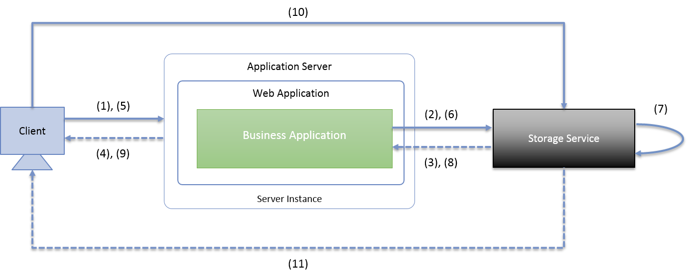

ダウンロードファイル管理
================================================================================

.. only:: html

 .. contents:: 目次
    :depth: 4
    :local:

Overview
--------------------------------------------------------------------------------

インターネットストレージは可用性、耐久性が共に高く、かつインターネット経由でアクセスできるため、ファイルサイズの大きなコンテンツを配信する基盤として適している。

ただし、特定のユーザにのみコンテンツを配信したい場合はアプリケーション認証と連動する必要があり、インターネットストレージの機能のみで適切にアクセス制御することはむずかしい。

本ガイドラインでは、インターネットストレージの制限付きURL機能を用いて、実質的に特定のユーザにのみコンテンツを配信する方式を説明する。

想定する要件
^^^^^^^^^^^^^^^^^^^^^^^^^^^^^^^^^^^^^^^^^^^^^^^^^^^^^^^^^^^^^^^^^^^^^^^^^^^^^^^^

- サイズの大きなコンテンツをダウンロードする
- 特定ユーザ、特定期間のみダウンロード可能とする

制約
^^^^^^^^^^^^^^^^^^^^^^^^^^^^^^^^^^^^^^^^^^^^^^^^^^^^^^^^^^^^^^^^^^^^^^^^^^^^^^^^

- 制限付きURLが漏えいした場合、第三者にもコンテンツが配信される可能性がある

方式概要
^^^^^^^^^^^^^^^^^^^^^^^^^^^^^^^^^^^^^^^^^^^^^^^^^^^^^^^^^^^^^^^^^^^^^^^^^^^^^^^^

本ガイドラインでは、クライアントがインターネットストレージの内容を一覧し、その中から目的のファイルをダウンロードするユースケースを想定している。

本方式では、制限付きURLが第三者に漏えいした場合に備えて制限付きURLの有効期限をできる限り短くする一方で、正規のクライアントには有効期限切れエラーが発生する可能性をできる限り低くするため、ファイルのダウンロードリクエスト時に動的に制限付きURLを発行する。

また、この制限付きURLは対象ファイルの取得のみに利用できるよう、ポリシー制御する。

方式イメージ
^^^^^^^^^^^^^^^^^^^^^^^^^^^^^^^^^^^^^^^^^^^^^^^^^^^^^^^^^^^^^^^^^^^^^^^^^^^^^^^^

本ガイドラインで紹介するプライベートダウンロード方式のイメージを示す。

.. tabularcolumns:: |p{0.10\linewidth}|p{0.90\linewidth}|
.. list-table::
   :header-rows: 1
   :widths: 10 90

   * - 項番
     - 説明
   * - | (1)
     - | クライアントは、アプリケーションにダウンロードファイルの一覧をリクエストする。
   * - | (2)
     - | アプリケーションは、インターネットストレージにダウンロードファイルの一覧をリクエストする。
   * - | (3)
     - | インターネットストレージは、アプリケーションにダウンロードファイルの一覧を返却する。
   * - | (4)
     - | アプリケーションは、クライアントにダウンロードファイルの一覧を返却する。
   * - | (5)
     - | クライアントは、アプリケーションにダウンロード対象ファイルの制限付きURLをリクエストする。
   * - | (6)
     - | アプリケーションは、インターネットストレージにダウンロード対象ファイルの制限付きURLをリクエストする。
   * - | (7)
     - | インターネットストレージは、リクエストされたダウンロード対象ファイルを取得する制限付きURLを生成する。
   * - | (8)
     - | インターネットストレージは、アプリケーションに生成した制限付きURLを返却する。
   * - | (9)
     - | アプリケーションは、取得した制限付きURLをクライアントに返却する。
   * - | (10)
     - | クライアントは、取得した制限付きURLを使ってインターネットストレージにファイルダウンロードをリクエストする。
   * - | (11)
     - | インターネットストレージは、リクエストされた制限付きURLの有効期限を確認し、期限内である場合はリクエストされたファイルを返却する。

How to use
--------------------------------------------------------------------------------

インターネットストレージの利用
^^^^^^^^^^^^^^^^^^^^^^^^^^^^^^^^^^^^^^^^^^^^^^^^^^^^^^^^^^^^^^^^^^^^^^^^^^^^^^^^

クラウドベンダーが提供するインターネットストレージサービスを利用して、プライベートダウンロードを実装する。

Amazon Web Service
""""""""""""""""""""""""""""""""""""""""""""""""""""""""""""""""""""""""""""""""

クラウドベンダーとしてAWSを使用する場合のプライベートダウンロードの実装例については、 :doc:`../../AWSCollaboration/FileManagement/DownloadFileManagement` を参照されたい。