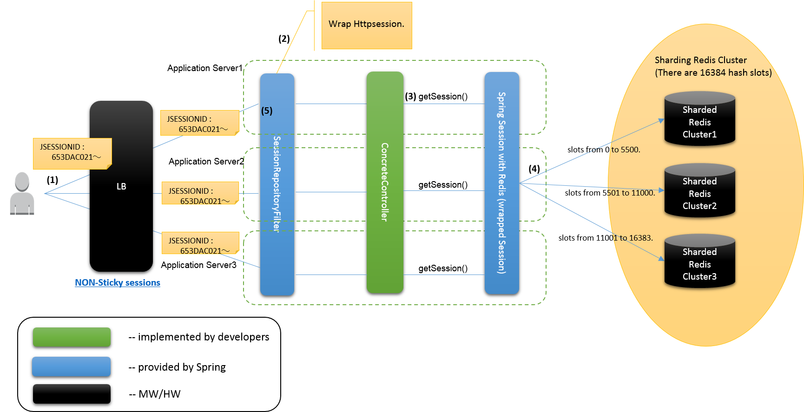
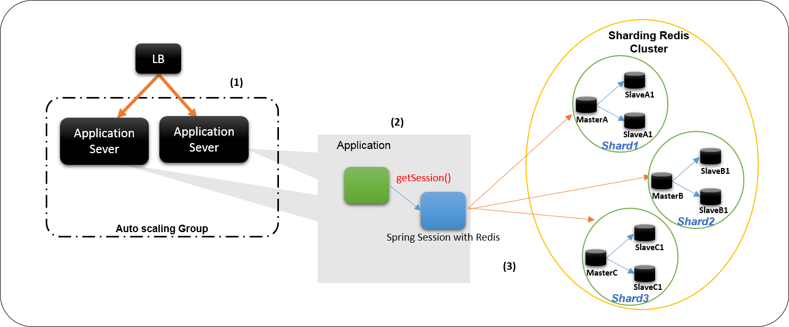

セッション外部管理
================================================================================

.. only:: html

 .. contents:: 目次
    :depth: 3
    :local:

Overview
--------------------------------------------------------------------------------

クラウド環境でオートスケーリングを利用した場合に、スケールイン発生時にセッションなどのアプリケーションサーバインスタンス固有の情報は失われてしまう。
その為、ロードバランサによるロードバランシングにおいてスティッキーセッションはOFFとし、アプリケーションの構造としてどのアプリケーションサーバインスタンスに
リクエストが割り振られた場合でも業務継続可能とする為のセッション外部管理方式を示す。

|

.. _session-management-label:

セッション外部管理方式
^^^^^^^^^^^^^^^^^^^^^^^^^^^^^^^^^^^^^^^^^^^^^^^^^^^^^^^^^^^^^^^^^^^^^^^^^^^^^^^^

セッション外部管理を行うために、\ `Spring Session with Redis <http://docs.spring.io/spring-session/docs/1.2.2.RELEASE/reference/html5/#httpsession-redis>`_\を利用した方式を以下に示す。
Redis構成は、ユーザ数（同時セッション数）が後々スケールできるようシャーディングを用いた構成で紹介している。

.. tabularcolumns:: |p{0.10\linewidth}|p{0.90\linewidth}|
.. list-table::
 :header-rows: 1
 :widths: 10 90

 * - 項番
   - 説明
 * - | (1)
   - | ユーザは、同一のセッションIDでアクセスを行う。
 * - | (2)
   - | \ ``SessionRepositoryFilter``\はセッションをラップする。
 * - | (3)
   - | \ `Apache Tiles <https://tiles.apache.org/>`_\ と \ `Tomcat <https://tomcat.apache.org/index.html>`_\ の組み合わせを使用している場合は、\ ``SessionEnforcerFilter``\を使用する必要がある。\ ``SessionEnforcerFilter``\はセッションが存在しない場合は、セッションを作成してリクエストURLにリダイレクトする。セッションが存在する場合は何も実施しない。また、セッションが存在しない場合は、リダイレクトが強制的に発生するため、URLパターンを適切に設定する必要がある。
     | \ `spring-session/issues/571 <https://github.com/spring-projects/spring-session/issues/571>`_\対応
 * - | (4)
   - | アプリケーションで作成したコントローラからgetSessionメソッドなどで、セッションへのアクセスを行った場合に、ラップ済みのセッションを通じてセッションを取得する。
 * - | (5)
   - | ラップ済みのセッションは、ローカルサーバのキャッシュにセッション情報が存在しない時はRedisから取得する。一度アクセスを行うと、そのリクエストの間はローカルにセッション情報をキャッシュする。シャーディングされたRedisからの取得は、データに対してkeyのhashを計算して、該当するhash slotにアクセスして取得する。
 * - | (6)
   - | レスポンスがコミットされたタイミングでRedisにセッション情報を格納する。

|

.. _session_management_constitution:

セッション外部管理構成
^^^^^^^^^^^^^^^^^^^^^^^^^^^^^^^^^^^^^^^^^^^^^^^^^^^^^^^^^^^^^^^^^^^^^^^^^^^^^^^^
セッション外部管理を行う為の基本的な構成を以下に示す。

.. tabularcolumns:: |p{0.10\linewidth}|p{0.90\linewidth}|
.. list-table::
 :header-rows: 1
 :widths: 10 90

 * - 項番
   - 説明
 * - | (1)
   - | ロードバランサのリクエスト振り分けはスティッキーセッションを使用せず、動的なスケーリンググループ内のAPサーバに対して均等に振り分ける。
 * - | (2)
   - | アプリケーションではSpring Session with Redisを介してセッションへのアクセスを行う。
 * - | (3)
   - | Spring Session with Redisは、Sharding Redis ClusterのいずれかのShardに対してセッションの保存を行う。各Shardでは、可用性向上のための非同期のレプリケーションが行われる。

|

セッション同期タイミング
^^^^^^^^^^^^^^^^^^^^^^^^^^^^^^^^^^^^^^^^^^^^^^^^^^^^^^^^^^^^^^^^^^^^^^^^^^^^^^^^
リクエスト中に、一度取得したセッション情報はキャッシュされていて、以降はキャッシュからセッション情報を取得する為、他のリクエストでのセッション情報への変更は反映されない。
Redisへ永続化を行うタイミングで各リクエストで行ったセッション情報の変更は上書きで保存されるため、後から永続化が行われたリクエストのセッション情報が反映される。

また、Redisへのセッションの永続化のタイミングは、デフォルトがレスポンスのコミット時となっている。

|

制約事項
^^^^^^^^^^^^^^^^^^^^^^^^^^^^^^^^^^^^^^^^^^^^^^^^^^^^^^^^^^^^^^^^^^^^^^^^^^^^^^^^

 * セッションの外部管理を行った場合は、「\ `同一セッション内のリクエストの同期化 <http://macchinetta.github.io/server-guideline/1.4.0.RELEASE/ja/ArchitectureInDetail/WebApplicationDetail/SessionManagement.html#id25>`_\ 」のような方法でリクエストを同期化することができないため、セッション情報の完全な同期が必要なケースは、セッションで情報を管理しないこと。

    .. note::
     二重送信防止で、セッションを利用したトランザクショントークンチェックは、トランザクショントークンの変更が即座に同期されないため、リクエストのタイミングに因っては、意図した動作をしないケースが存在する。
     そのため、セッションの外部管理を行う場合は、セッションを利用したトランザクショントークンチェックの機能面で制限が発生する点に注意する。
     代替手段としては、トランザクショントークンの永続化先をデータベースに変更してロックを使用した排他制御を行うか、アプリケーションを冪等に実装して二重送信が発生しても問題がないようにするとよい（後者の場合は二重送防止処理自体が不要になる）。

 * Spring Session with Redisは、Keyspace Notificationsを使用してセッション生成・破棄イベントをアプリケーションに通知することが出来る。
   イベント通知は全てのアプリケーションサーバに対して行われ、各サーバにおいて\ ``HttpSessionListener``\が実行されるため、\ ``HttpSessionListener``\は冪等に実装する必要がある。
   また、RedisはKeyspace NotificationsがOFFになっているので、破棄イベントを実装する場合はKeyspace NotificationsをONに設定する必要がある。
   詳細は、\ `SessionDeletedEvent and SessionExpiredEvent <http://docs.spring.io/spring-session/docs/1.2.2.RELEASE/reference/html5/#api-redisoperationssessionrepository-sessiondestroyedevent>`_\ を参照されたい。

 * Servlet仕様では、セッションIDを示すHTTP Cookieの名称は、「JSESSIONID」だが、Spring Sessionを使用した場合のデフォルトは「SESSION」となる。
   変更方法は、\ `Spring Session - Custom Cookie <http://docs.spring.io/spring-session/docs/1.2.2.RELEASE/reference/html5/guides/custom-cookie.html>`_\を参照されたい。

|

Redis Clusterの一貫性保証
^^^^^^^^^^^^^^^^^^^^^^^^^^^^^^^^^^^^^^^^^^^^^^^^^^^^^^^^^^^^^^^^^^^^^^^^^^^^^^^^
:ref:`session_management_constitution` で説明したとおり、Redis Clusterにおける各Shardでは、マスターノードからスレーブノードへの非同期のレプリケーションが行われている。
以下の条件を満たす場合、データの書き込み完了をクライアントに通知したにもかかわらず、データを失う可能性がある。

#. クライアントがマスタノードへの書き込み要求を行う。
#. マスターノードは書き込み処理を行い、書き込み完了をクライアントに通知する。
#. マスターノードからスレーブノードへのレプリケーションが完了する前にマスターノードがダウンする。
#. スレーブノードがマスターノードへ昇格する。

この時、レプリケーションされなかったデータについては消失することになる。
また、クライアントが書き込み要求を行っているマスターノードがShardから分断された場合についても書き込み要求を行っていたノードのダウンが発生するため、レプリケーションが行われなかったデータは消失する。

Redis Clusterを使用したセッションの外部管理を行う場合は、データ消失の可能性がある点に留意すること。

より詳しい情報は、\ `Redis Cluster consistency guarantees <https://redis.io/topics/cluster-tutorial#redis-cluster-consistency-guarantees>`_\を参照されたい。

|

How to use
--------------------------------------------------------------------------------

\ `Spring Session with Redis <http://docs.spring.io/spring-session/docs/1.2.2.RELEASE/reference/html5/#httpsession-redis>`_\の利用方法を示す。

|

依存ライブラリの追加
^^^^^^^^^^^^^^^^^^^^^^^^^^^^^^^^^^^^^^^^^^^^^^^^^^^^^^^^^^^^^^^^^^^^^^^^^^^^^^^^

セッション外部管理では、\ `Spring Session with Redis <http://docs.spring.io/spring-session/docs/1.2.2.RELEASE/reference/html5/#httpsession-redis>`_\を使用するための依存ライブラリを追加する必要がある。
定義方法は、以下を参照されたい。

- :file:`pom.xml`

 .. code-block:: xml

   <dependencies>
           <!-- (1) -->
           <dependency>
                   <groupId>org.springframework.session</groupId>
                   <artifactId>spring-session</artifactId>
           </dependency>
           <!-- (2) -->
           <dependency>
                   <groupId>org.springframework.boot</groupId>
                   <artifactId>spring-boot-starter-redis</artifactId>
           </dependency>
   </dependencies>

 .. tabularcolumns:: |p{0.10\linewidth}|p{0.90\linewidth}|
 .. list-table::
   :header-rows: 1
   :widths: 10 90

   * - 項番
     - 説明
   * - | (1)
     - | 依存ライブラリに\ ``spring-session``\を追加する。
   * - | (2)
     - | 依存ライブラリに\ ``spring-boot-starter-redis``\を追加する。

|

.. _springSessionRepositoryFilter-label:

Spring Sessionの設定
^^^^^^^^^^^^^^^^^^^^^^^^^^^^^^^^^^^^^^^^^^^^^^^^^^^^^^^^^^^^^^^^^^^^^^^^^^^^^^^^

セッション外部管理を行うために、\ `Spring Session with Redis <http://docs.spring.io/spring-session/docs/1.2.2.RELEASE/reference/html5/#httpsession-redis>`_\を利用する。

- :file:`application-context.xml`

 .. code-block:: xml

   <!-- (1) -->
   <context:annotation-config/>
   <bean class="org.springframework.session.data.redis.config.annotation.web.http.RedisHttpSessionConfiguration"/>

 .. tabularcolumns:: |p{0.10\linewidth}|p{0.90\linewidth}|
 .. list-table::
   :header-rows: 1
   :widths: 10 90

   * - 項番
     - 説明
   * - | (1)
     - | \ ``<context：annotation-config />``\と\ ``RedisHttpSessionConfiguration``\の組み合わせで、\ ``springSessionRepositoryFilter``\のという名前のSpring Beanを作成する。

|

- :file:`xxx-env.xml`

 .. code-block:: xml

   <!-- (1) -->
    <bean id="springSessionRedisTaskExecutor" class="org.springframework.core.task.SimpleAsyncTaskExecutor">
        <property name="concurrencyLimit" value="${spring.redis.listener.concurrencyLimit}" />
    </bean>

 .. tabularcolumns:: |p{0.10\linewidth}|p{0.90\linewidth}|
 .. list-table::
   :header-rows: 1
   :widths: 10 90

   * - 項番
     - 説明
   * - | (1)
     - | \ ``RedisMessageListenerContainer``\が使用する\ ``TaskExecutor``\ のBean定義を行う。

 .. note::
  \ ``RedisMessageListenerContainer``\は、Subscribe処理の際に\ ``springSessionRedisTaskExecutor``\ のBean名で定義された\ ``TaskExecutor``\ を使用し、Redis上のデータへアクセスを行う。
  デフォルトで使用される\ ``SimpleAsyncTaskExecutor``\ はSubscribeの都度、無制限に新規にスレッドを作成し、Redisのコネクションを取得するため、作成されるスレッド数を制限しておくことを推奨する。
  上記の例では、デフォルトで使用される\ ``SimpleAsyncTaskExecutor``\ に対して\ ``concurrencyLimit``\ を設定することで、作成されるスレッド数に上限を設定している。
  
|

- :file:`web.xml`

 .. code-block:: xml

   <!-- (1) -->
   <filter>
       <filter-name>springSessionRepositoryFilter</filter-name>
       <filter-class>org.springframework.web.filter.DelegatingFilterProxy</filter-class>
   </filter>
   <filter-mapping>
       <filter-name>springSessionRepositoryFilter</filter-name>
       <url-pattern>/*</url-pattern>
       <dispatcher>REQUEST</dispatcher>
       <dispatcher>ERROR</dispatcher>
   </filter-mapping>

 .. tabularcolumns:: |p{0.10\linewidth}|p{0.90\linewidth}|
 .. list-table::
   :header-rows: 1
   :widths: 10 90

   * - 項番
     - 説明
   * - | (1)
     - | \ ``DelegatingFilterProxy``\を使用して\ ``springSessionRepositoryFilter``\を登録する。また、セッションが存在しない状態でフィルタを通過する前にエラーが発生した場合にも\ ``springSessionRepositoryFilter``\ が適用されるよう、\ ``dispatcher``\ に\ ``ERROR``\ も設定する。設定については、\ `XML Servlet Container Initialization <http://docs.spring.io/spring-session/docs/1.2.2.RELEASE/reference/html5/guides/httpsession-xml.html#xml-servlet-container-initialization>`_\を参照されたい。

 .. note::
  \ ``dispatcher``\ に指定する値はシステム要件に応じて全てのリクエストに対して\ ``springSessionRepositoryFilter``\ が適用されるよう設定すること。
  例えば、JSPのincludeを行っている場合は\ ``dispatcher``\ に\ ``INCLUDE``\ を追加する必要がある。

 .. note::
  \ ``DelegatingFilterProxy``\ は\ ``filter-name``\ で指定した名前(上記の例では\ ``springSessionRepositoryFilter``\ )でDIコンテナからBeanを取得して、処理を委譲する。対象のBeanは\ ``Filter``\ を実装する必要がある。Springの下で統一的に\ ``Filter``\ が管理でき、コンテナ上の各種Beanを利用して\ ``Filter``\ が実装できるなどのメリットがある。

 .. warning::
  \ ``springSessionRepositoryFilter``\の登録順序は、\ ``HttpSession``\を使用する他の ``Filter``\より前に登録する必要がある。

|

- :file:`application.yml`

 .. code-block:: yaml

   # (1)
   spring:
     session:
       store-type: redis

   # (2)
     redis:
       listener:
         concurrencyLimit: 2

 .. tabularcolumns:: |p{0.10\linewidth}|p{0.90\linewidth}|
 .. list-table::
   :header-rows: 1
   :widths: 10 90

   * - 項番
     - 説明
   * - | (1)
     - | \ ``spring.session.store-type``\にredisを指定する。
   * - | (2)
     - | \ ``spring.redis.listener.concurrencyLimit``\にSubscribe処理の際に使用するスレッドの上限を設定する。

|

Apache TilesとTomcatの組み合わせでレスポンスにCookieが設定されない問題の対応
^^^^^^^^^^^^^^^^^^^^^^^^^^^^^^^^^^^^^^^^^^^^^^^^^^^^^^^^^^^^^^^^^^^^^^^^^^^^^^^^^^^^^^^^^^^^^^^^^^^^^^^^^^^^^^^^^^^^^^^^^^^^^^^^^^^^^^^^^^^^^^^^^^^^^^^^^^^^^^^^
| Spring Sessionを使用する際に、\ `Apache Tiles <https://tiles.apache.org/>`_\ と \ `Tomcat <https://tomcat.apache.org/index.html>`_\ の組み合わせでアプリケーションを作成している場合に、レスポンスにCookieが設定されない問題に対応する必要がある。
| この問題に対する詳細は、\ `spring-session/issues/571 <https://github.com/spring-projects/spring-session/issues/571>`_\を参照されたい。

|

SessionEnforcerFilter の作成および設定
""""""""""""""""""""""""""""""""""""""""""""""""""""""""""""""""""""""""""""""""
SessionEnforcerFilter の作成および設定方法を以下に示す。

- :file:`SessionEnforcerFilter .java`

 .. code-block:: java

   public class SessionEnforcerFilter implements Filter {

      ...

       @Override
       public void doFilter(ServletRequest request, ServletResponse response,
               FilterChain chain) throws IOException, ServletException {
           HttpServletRequest httpServletRequest = (HttpServletRequest) request;
           HttpServletResponse httpServletResponse = (HttpServletResponse) response;

           if (httpServletRequest.getSession(false) == null) {

               httpServletRequest.getSession(); // (1)
               StringBuilder requestURI = new StringBuilder(httpServletRequest
                       .getRequestURI());
               if (httpServletRequest.getQueryString() != null) {
                   requestURI.append("?").append(httpServletRequest
                           .getQueryString());
               }

               httpServletResponse.sendRedirect(requestURI.toString()); // (2)
           } else {
               chain.doFilter(httpServletRequest, response);
           }
       }

       ...

   }

 .. tabularcolumns:: |p{0.10\linewidth}|p{0.90\linewidth}|
 .. list-table::
   :header-rows: 1
   :widths: 10 90

   * - 項番
     - 説明
   * - | (1)
     - | \ ``HttpSession``\が存在しない場合に強制的に作成する。
   * - | (2)
     - | リクエストを受け付けたパスでリダイレクト実施する。

|

- :file:`web.xml`

 .. code-block:: xml

   <!-- (1) -->
    <filter>
        <filter-name>sessionEnforcerFilter</filter-name>
        <filter-class>com.example.xxx.app.SessionEnforcerFilter</filter-class>
    </filter>
    <filter-mapping>
        <filter-name>sessionEnforcerFilter</filter-name>
        <url-pattern>/*</url-pattern>
            <dispatcher>REQUEST</dispatcher>
            <dispatcher>ERROR</dispatcher>
    </filter-mapping>

 .. tabularcolumns:: |p{0.10\linewidth}|p{0.90\linewidth}|
 .. list-table::
   :header-rows: 1
   :widths: 10 90

   * - 項番
     - 説明
   * - | (1)
     - | \ ``sessionEnforcerFilter``\を :ref:`springSessionRepositoryFilter-label` で登録した\ ``springSessionRepositoryFilter``\の直後に登録する。

|

    .. note::

      本ガイドラインで紹介している\ ``SessionEnforcerFilter``\はセッションが存在しない場合に、セッションを作成してリクエストURLにリダイレクトする実装を行うことで問題に対応している。
      リダイレクトを強制的に発生させているため、システム要件に応じて使用するURLパターンとリダイレクト先のURL不整合が生じないよう留意する必要がある。

Spring Data Redisの設定
^^^^^^^^^^^^^^^^^^^^^^^^^^^^^^^^^^^^^^^^^^^^^^^^^^^^^^^^^^^^^^^^^^^^^^^^^^^^^^^^
\ ``spring-boot-starter-redis``\を使用している為、基本的な設定はAutoConfigurationにて行われる。
詳細な設定については、Spring Boot Reference Guideの \ `Common application properties <https://docs.spring.io/spring-boot/docs/1.4.3.RELEASE/reference/html/common-application-properties.html#common-application-properties>`_\ の# REDIS (RedisProperties)を参照されたい。

|

.. _session-management-endpoint-label:

エンドポイントの設定
""""""""""""""""""""""""""""""""""""""""""""""""""""""""""""""""""""""""""""""""
エンドポイント設定は、Spring Data Redisの設定にて定義する。
詳細は、\ `Redis Cluster <http://docs.spring.io/spring-data/redis/docs/1.7.6.RELEASE/reference/html/#cluster>`_\を参照されたい。

- :file:`application.yml`

 .. code-block:: yaml

   spring:
     redis:
       cluster:
         # (1)
         nodes:
           - 127.0.0.1:30001
           - 127.0.0.1:30002
           - 127.0.0.1:30003

|

 .. tabularcolumns:: |p{0.10\linewidth}|p{0.90\linewidth}|
 .. list-table::
   :header-rows: 1
   :widths: 10 90

   * - キー
     - 説明
   * - | (1)
     - | \ ``spring.redis.cluster.nodes``\にすべてのノードを追加する。
         詳細は、\ `Enabling Redis Cluster <http://docs.spring.io/spring-data/redis/docs/1.7.6.RELEASE/reference/html/#_enabling_redis_cluster>`_\を参照されたい。

|

クラウドベンダーの利用
^^^^^^^^^^^^^^^^^^^^^^^^^^^^^^^^^^^^^^^^^^^^^^^^^^^^^^^^^^^^^^^^^^^^^^^^^^^^^^^^

クラウドベンダー提供の環境を利用する場合のガイドラインについて記載箇所を示しておく。

Amazon Web Service
""""""""""""""""""""""""""""""""""""""""""""""""""""""""""""""""""""""""""""""""

クラウドベンダーとしてAWSを使用する場合のセッション外部管理については、
:doc:`../AWSCollaboration/SessionManagement`
を参照されたい。

How to extend
--------------------------------------------------------------------------------

本ガイドラインでは、拡張方法や応用的な使用方法を示す。

|

セッション永続化タイミングの変更
^^^^^^^^^^^^^^^^^^^^^^^^^^^^^^^^^^^^^^^^^^^^^^^^^^^^^^^^^^^^^^^^^^^^^^^^^^^^^^^^

セッション永続化のタイミングは、デフォルトでレスポンスのコミット時になっているが、以下の様に定義することで\ ``setAttribute``\ および\ ``removeAttribute``\ メソッド呼び出し時に変更することができる。

- :file:`application.yml`

 .. code-block:: yaml

   spring:
     session:
       redis:
         flush-mode: immediate #(1)

|

 .. tabularcolumns:: |p{0.10\linewidth}|p{0.90\linewidth}|
 .. list-table::
   :header-rows: 1
   :widths: 10 90

   * - キー
     - 説明
   * - | (1)
     - | \ ``spring.session.redis.flush-mode``\に\ ``immediate``\を設定する。デフォルトは、\ ``on-save``\となっている。

 .. warning::
   \ ``immediate``\を設定する際の注意事項を以下に示す。

    * \ ``setAttrubute``\ の実行回数が多い場合は、頻繁にIOが発生するため性能に影響が出る。
    * \ ``setAttrubute``\ が複数実行される処理に並行し、readしている人が別にいた場合に、変更途中のセッションが読まれてしまう可能性が高まる。
    * \ ``getAttribute``\ を使用して取得したオブジェクトに対する変更を行っても永続化は行われない。ただし、他の属性に対する\ ``setAttribute``\ および\ ``removeAttribute``\ メソッド実行時に全てのセッション情報が永続化される。

 .. note::
   \ ``immediate``\を設定している場合でも、レスポンスのコミット時の永続化は行われる。

|

HttpSessionListenerを利用する場合の設定方法
^^^^^^^^^^^^^^^^^^^^^^^^^^^^^^^^^^^^^^^^^^^^^^^^^^^^^^^^^^^^^^^^^^^^^^^^^^^^^^^^
HttpSessionListenerを使用する場合の設定方法を以下に示す。詳細は、\ `HttpSessionListener <http://docs.spring.io/spring-session/docs/1.2.2.RELEASE/reference/html5/#httpsession-httpsessionlistener>`_\を参照されたい。

- :file:`applicationContext.xml`

 .. code-block:: xml

   <!-- (1) -->
   <bean class="org.terasoluna.gfw.web.logging.HttpSessionEventLoggingListener" />

|

 .. tabularcolumns:: |p{0.10\linewidth}|p{0.90\linewidth}|
 .. list-table::
   :header-rows: 1
   :widths: 10 90

   * - キー
     - 説明
   * - | (1)
     - | 使用する\ ``HttpSessionListener``\をBean定義する。

|

.. raw:: latex

   \newpage
