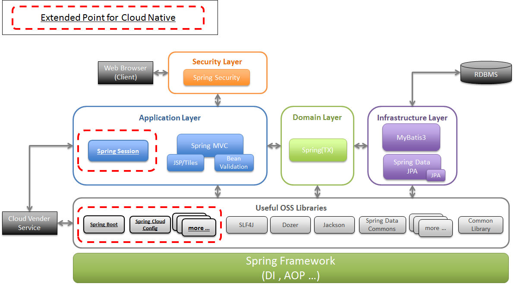

フレームワークスタック
================================================================================

.. only:: html

 .. contents:: 目次
    :depth: 3
    :local:

|framework_name| 概要
--------------------------------------------------------------------------------

本ガイドラインで使用するSoftware Frameworkは、|base_framework_name| で使用するものに加えて、クラウドベンダーが提供するサービスと連携するためのOSSを組み合わせたものである。

|base_framework_name| で使用するSoftware Frameworkについては、 |base_framework_name| `Development Guideline <https://macchinetta.github.io/server-guideline/1.5.0.RELEASE/ja/Overview/FrameworkStack.html>`_  を参照されたい。

Software Frameworkの主な構成要素
--------------------------------------------------------------------------------
|framework_name| を構成するライブラリを以下に示す。
本ガイドラインでは、|base_framework_name| Development Guidelineで説明済みのライブラリについては説明を行わない。

セッションの外部管理
^^^^^^^^^^^^^^^^^^^^^^^^^^^^^^^^^^^^^^^^^^^^^^^^^^^^^^^^^^^^^^^^^^^^^^^^^^^^^^^^
セッションの外部管理を行うフレームワークとして、Spring Sessionを利用する。

* `Spring Session 1.3 <http://projects.spring.io/spring-session/>`_

キャッシュの管理
^^^^^^^^^^^^^^^^^^^^^^^^^^^^^^^^^^^^^^^^^^^^^^^^^^^^^^^^^^^^^^^^^^^^^^^^^^^^^^^^
Redisを使用したキャッシュの管理を行うフレームワークとして、Spring Data Redisを利用する。

* `Spring Data Redis 1.8 <http://projects.spring.io/spring-data-redis/>`_

環境依存値の外部管理
^^^^^^^^^^^^^^^^^^^^^^^^^^^^^^^^^^^^^^^^^^^^^^^^^^^^^^^^^^^^^^^^^^^^^^^^^^^^^^^^
環境依存値の外部管理を行うフレームワークとして、Spring Cloud Configを利用する。

* `Spring Cloud Config 1.3 <https://cloud.spring.io/spring-cloud-config/>`_

クラウドベンダー連携
^^^^^^^^^^^^^^^^^^^^^^^^^^^^^^^^^^^^^^^^^^^^^^^^^^^^^^^^^^^^^^^^^^^^^^^^^^^^^^^^
クラウドベンダー連携を行うライブラリとして以下を利用する。

Spring Boot
""""""""""""""""""""""""""""""""""""""""""""""""""""""""""""""""""""""""""""""""

以下の目的でSpring Bootを導入している。

* `Spring Cloud Dalston.SR4 <http://projects.spring.io/spring-cloud/>`_ の利用
* `Spring Boot Actuator 1.5 <http://docs.spring.io/spring-boot/docs/1.5.7.RELEASE/reference/htmlsingle/#production-ready>`_ の利用

.. note::

    Spring CloudはSpring Bootに依存した実装となっている。

.. note::

    本ガイドラインでは、|base_framework_name|  Development Guidelineで説明しているアプリケーション・アーキテクチャおよびノウハウを使用してクラウドネイティブなアプリケーションを開発するための方法を説明している。そのため、Spring Boot機能の利用は限定的なものとし、Spring Bootを使用することにより生じる制約や実装方法の相違点については適宜補足説明を行う。

Amazon Web Service
""""""""""""""""""""""""""""""""""""""""""""""""""""""""""""""""""""""""""""""""

Amazon Web Serviceとの連携を行うフレームワークとして以下を利用する。

* `Spring Cloud for Amazon Web Services 1.2 <https://cloud.spring.io/spring-cloud-aws/>`_
* `Spring Data DynamoDB 4.5 <https://github.com/derjust/spring-data-dynamodb>`_
* `AWS SDK for Java 1.11 <https://aws.amazon.com/jp/sdk-for-java/>`_

共通ライブラリ
^^^^^^^^^^^^^^^^^^^^^^^^^^^^^^^^^^^^^^^^^^^^^^^^^^^^^^^^^^^^^^^^^^^^^^^^^^^^^^^^

|framework_name| で利用する共通ライブラリは、|base_framework_name| の共通ライブラリと同様である。

利用するOSSのバージョン
--------------------------------------------------------------------------------

|framework_name| |framework_version| で利用するOSSの一覧を以下に示す。
|base_framework_name| Development Guideline `利用するOSSのバージョン <https://macchinetta.github.io/server-guideline/1.5.0.RELEASE/ja/Overview/FrameworkStack.html#oss>`_ において説明済みのOSSについては記載しない。

|framework_name| と |base_framework_name| のバージョンの対応関係は、:ref:`cloud_native_application_framework_relation` を参照されたい。

.. tip::

    |base_framework_name| と同様に、 `Spring IO platform <http://platform.spring.io/platform/>`_\ にて依存関係を解決可能なライブラリについては原則として、Spring IO platformの定義に準じている。使用するSpring IO platformのバージョンは |base_framework_name| に準じる。

    `Spring Cloud <http://projects.spring.io/spring-cloud/>`_\ 関連のライブラリについては、\ ``spring-cloud-dependencies``\ による定義に準じている。使用する\ ``spring-cloud-dependencies``\ のバージョンは、依存関係を解決されるライブラリのバージョンが可能な限りSpring IO platformと同一となるようバージョンを選定し、Dalston.SR4としている。

    上記に該当しないライブラリについては、個別にバージョンを指定している。

.. tabularcolumns:: |p{0.15\linewidth}|p{0.25\linewidth}|p{0.25\linewidth}|p{0.15\linewidth}|p{0.05\linewidth}|p{0.05\linewidth}|p{0.05\linewidth}|
.. list-table::
    :header-rows: 1
    :stub-columns: 1
    :widths: 15 25 25 15 5 5 5

    * - Type
      - GroupId
      - ArtifactId
      - Version
      - Spring IO platform
      - Spring Cloud
      - Remarks
    * - セッション管理
      - org.springframework.session
      - spring-session
      - 1.3.1.RELEASE
      - \*
      -
      -
    * - セッション管理
      - org.springframework.session
      - spring-session-data-redis
      - 1.3.1.RELEASE
      - \*
      -
      -
    * - セッション管理
      - redis.clients
      - jedis
      - 2.9.0
      - \*
      -
      -
    * - キャッシュ管理
      - org.springframework.data
      - spring-data-keyvalue
      - 1.2.7.RELEASE
      - \*
      -
      -
    * - キャッシュ管理
      - org.springframework.data
      - spring-data-redis
      - 1.8.7.RELEASE
      - \*
      -
      -
    * - Spring Boot
      - org.springframework.boot
      - spring-boot
      - 1.5.7.RELEASE
      - \*
      - \*
      - \*1
    * - Spring Boot
      - org.springframework.boot
      - spring-boot-actuator
      - 1.5.7.RELEASE
      - \*
      - \*
      - \*1
    * - Spring Boot
      - org.springframework.boot
      - spring-boot-autoconfigure
      - 1.5.7.RELEASE
      - \*
      - \*
      - \*1
    * - Spring Boot
      - org.springframework.boot
      - spring-boot-starter
      - 1.5.7.RELEASE
      - \*
      - \*
      - \*1
    * - Spring Boot
      - org.springframework.boot
      - spring-boot-starter-actuator
      - 1.5.7.RELEASE
      - \*
      - \*
      - \*1
    * - Spring Boot
      - org.springframework.boot
      - spring-boot-starter-logging
      - 1.5.7.RELEASE
      - \*
      - \*
      - \*1
    * - Spring Boot
      - org.slf4j
      - jul-to-slf4j
      - 1.7.25
      - \*
      -
      -
    * - Spring Boot
      - org.yaml
      - snakeyaml
      - 1.17
      - \*
      -
      -
    * - Spring Boot
      - org.slf4j
      - log4j-over-slf4j
      - 1.7.25
      - \*
      -
      -
    * - 環境依存値外部管理
      - org.springframework.cloud
      - spring-cloud-commons
      - 1.2.4.RELEASE
      -
      - \*
      -
    * - 環境依存値外部管理
      - org.springframework.cloud
      - spring-cloud-config-client
      - 1.3.3.RELEASE
      -
      - \*
      -
    * - 環境依存値外部管理
      - org.springframework.cloud
      - spring-cloud-context
      - 1.2.4.RELEASE
      -
      - \*
      -
    * - クラウドベンダー連携
      - org.springframework.cloud
      - spring-cloud-aws-actuator
      - 1.2.1.RELEASE
      -
      - \*
      -
    * - クラウドベンダー連携
      - org.springframework.cloud
      - spring-cloud-aws-autoconfigure
      - 1.2.1.RELEASE
      -
      - \*
      -
    * - クラウドベンダー連携
      - org.springframework.cloud
      - spring-cloud-aws-context
      - 1.2.1.RELEASE
      -
      - \*
      -
    * - クラウドベンダー連携
      - org.springframework.cloud
      - spring-cloud-aws-core
      - 1.2.1.RELEASE
      -
      - \*
      -
    * - クラウドベンダー連携
      - org.springframework.cloud
      - spring-cloud-aws-jdbc
      - 1.2.1.RELEASE
      -
      - \*
      -
    * - クラウドベンダー連携
      - org.springframework.cloud
      - spring-cloud-aws-messaging
      - 1.2.1.RELEASE
      -
      - \*
      -
    * - クラウドベンダー連携
      - org.springframework.cloud
      - spring-cloud-starter-aws
      - 1.2.1.RELEASE
      -
      - \*
      -
    * - クラウドベンダー連携
      - com.amazonaws
      - aws-java-sdk-cloudformation
      - 1.11.125
      -
      - \*
      -
    * - クラウドベンダー連携
      - com.amazonaws
      - aws-java-sdk-cloudwatch
      - 1.11.125
      -
      - \*
      -
    * - クラウドベンダー連携
      - com.amazonaws
      - aws-java-sdk-core
      - 1.11.125
      -
      - \*
      -
    * - クラウドベンダー連携
      - com.amazonaws
      - aws-java-sdk-ec2
      - 1.11.125
      -
      - \*
      -
    * - クラウドベンダー連携
      - com.amazonaws
      - aws-java-sdk-iam
      - 1.11.125
      -
      - \*
      -
    * - クラウドベンダー連携
      - com.amazonaws
      - aws-java-sdk-kms
      - 1.11.125
      -
      - \*
      -
    * - クラウドベンダー連携
      - com.amazonaws
      - aws-java-sdk-rds
      - 1.11.125
      -
      - \*
      -
    * - クラウドベンダー連携
      - com.amazonaws
      - aws-java-sdk-s3
      - 1.11.125
      -
      - \*
      -
    * - クラウドベンダー連携
      - com.amazonaws
      - aws-java-sdk-ses
      - 1.11.125
      -
      - \*
      -
    * - クラウドベンダー連携
      - com.amazonaws
      - jmespath-java
      - 1.11.125
      -
      - \*
      - \*2
    * - クラウドベンダー連携
      - com.amazonaws
      - aws-java-sdk-sns
      - 1.11.125
      -
      - \*
      -
    * - クラウドベンダー連携
      - com.amazonaws
      - aws-java-sdk-sqs
      - 1.11.125
      -
      - \*
      -
    * - クラウドベンダー連携
      - com.amazonaws
      - aws-java-sdk-sqs
      - 1.11.125
      -
      - \*
      -
    * - クラウドベンダー連携
      - org.apache.tomcat
      - tomcat-jdbc
      - 8.5.20
      - \*
      - \*
      - \*2 \*4
    * - クラウドベンダー連携
      - org.apache.tomcat
      - tomcat-juli
      - 8.5.20
      -
      - \*
      - \*2
    * - クラウドベンダー連携
      - org.apache.commons
      - commons-codec
      - 1.10
      - \*
      - \*
      - \*2 \*3
    * - クラウドベンダー連携
      - org.apache.commons
      - commons-logging
      - 1.2
      - \*
      - \*
      - \*2 \*3
    * - クラウドベンダー連携
      - org.apache.httpcomponents
      - httpclient
      - 4.5.3
      - \*
      - \*
      - \*2 \*4
    * - クラウドベンダー連携
      - org.apache.httpcomponents
      - httpcore
      - 4.4.6
      - \*
      - \*
      - \*2 \*4
    * - クラウドベンダー連携
      - com.fasterxml.jackson.dataformat
      - jackson-dataformat-cbor
      - 2.8.10
      - \*
      - \*
      - \*2 \*3
    * - クラウドベンダー連携
      - com.sun.mail
      - javax.mail
      - 1.5.6
      - \*
      - \*
      - \*5
    * - クラウドベンダー連携
      - com.amazonaws
      - amazon-sqs-java-messaging-lib
      - 1.0.1
      -
      -
      - \*5
    * - クラウドベンダー連携
      - org.apache.geronimo.specs
      - geronimo-jms_1.1_spec
      - 1.1.1
      -
      -
      - \*5
    * - クラウドベンダー連携
      - com.github.derjust
      - spring-data-dynamodb
      - 4.5.0
      -
      -
      - \*5
    * - クラウドベンダー連携
      - com.amazonaws
      - aws-java-sdk-dynamodb
      - 1.11.125
      -
      -
      - \*5
    * - クラウドベンダー連携
      - software.amazon.ion
      - ion-java
      - 1.0.2
      -
      -
      - \*2

#. | Spring IO platformにより定義しているバージョンを優先しているライブラリ。
#. | Spring Cloud for Amazon Web ServicesまたはAWS SDK for Javaが個別に依存しているライブラリ
#. | Spring IO platformと\ ``spring-cloud-dependencies``\ のバージョン定義が同一であるライブラリ
#. | Spring IO platformによりバージョンが定義されているが、\ ``spring-cloud-dependencies``\ によるバージョン定義を優先しているライブラリ
#. | クラウドベンダー連携のために個別に導入するライブラリ

.. raw:: latex

   \newpage
